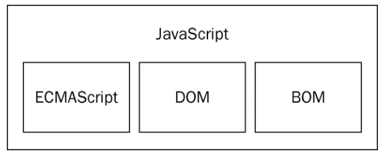

## JavaScript高级程序设计

### 第一章：JavaScript简介

#### 1.2 JavaScript实现：

一个完整的JavaScript实现应该由下列三个不同的部分组成:



##### 核心(ECMAScript): 

由ECMA-262定义的ECMAScript规定了：

​		语法，类型，语句，关键字，保留字，操作符，对象

##### 文档对象模型(DOM)

​		针对XML但扩展用于HTML的应用程序编程接口

DOM1级：有两个模块：

​			1. DOM核心（DOM Core）:　如何映射基于XML的文档结构,简化对文档的操作和访问。

​			2. DOM HTML：扩展DOM核心，添加针对HTML的对象和语法

DOM2级：扩充鼠标和用户界面事件，范围，遍历等细分模块，增加对CSS的支持。DOM1级中的DOM核心模块经过扩展开始支持XML命名空间。

给出新类型和新接口的定义。

DOM视图：定义了跟踪不同文档视图的接口

DOM事件：定义了事件和事件处理的接口

DOM样式：定义了基于CSS为元素应用样式的接口

DOM遍历和范围：定义了遍历和操作文档树的接口

##### 浏览器对象模型(BOM)			

从根本上讲，BOM只处理浏览器窗口和框架；但人们习惯上也把所有针对浏览器的JavaScript扩展算作BOM的一部分。

下面就是一些这样的扩展：

- 弹出新浏览器窗口的功能；
- 移动、缩放和关闭浏览器窗口的功能；
- 提供浏览器详细信息的`navigator`对象；
- 提供浏览器所加载页面的详细信息的`location`对象；
- 提供用户显示器分辨率详细信息的`screen`对象；
- 对cookies的支持；
- 像`XMLHttpRequest`和IE的`ActiveXObject`这样的自定义对象。

##### 小结

- ECMAScript，由ECMA-262定义，提供核心语言功能；
- 文档对象模型（DOM），提供访问和操作网页内容的方法和接口；
- 浏览器对象模型（BOM），提供与浏览器交互的方法和接口。

### 第二章：html中使用JavaScript

#### 2.1`<script>`标签

向HTML页面中插入JavaScript的主要方法，就是使用`<script>`元素。

使用`<script>`元素的方式有两种：直接在页面中嵌入JavaScript代码和包含外部JavaScript文件。

在使用`<script>`元素嵌入JavaScript代码时，只须为`<script>`指定`type`属性。然后，像下面这样把JavaScript代码直接放在元素内部即可：

```
<script type="text/javascript">
    function sayHi(){ 
        alert("Hi!");
    }
</script>
```

要通过`<script>`元素来包含外部JavaScript文件，那么`src`属性就是必需的。这个属性的值是一个指向外部JavaScript文件的链接，例如：

```
<script type="text/javascript" src="example.js"></script>
```

所有`<script>`元素都会按照它们在页面中出现的先后顺序依次被解析。在不使用`defer`和`async`属性的情况下，只有在解析完前面`<script>`元素中的代码之后，才会开始解析后面`<script>`元素中的代码。

### 第三章：基本概念

#### 3.1语法

- ##### 区分大小写

ECMAScript中的一切（变量、函数名和操作符）都区分大小写。

- ##### 标识符

标识符，就是指变量、函数、属性的名字，或者函数的参数。

- 第一个字符必须是一个字母、下划线（`_`）或一个美元符号（`$`）；
- 其他字符可以是字母、下划线、美元符号或数字。

不能把关键字、保留字、**`true`**、**`false`**和**`null`**用作标识符。

##### **3.1.3　注释**

```
// 单行注释
```

块级注释以一个斜杠和一个星号（`/*`）开头，以一个星号和一个斜杠（`*/`）结尾，如下所示：

```
/*
 *  这是一个多行
 *  （块级）注释
 */
```

##### **3.1.4　严格模式**

要在整个脚本中启用严格模式，可以在顶部添加如下代码：

```
"use strict";
```

在函数内部的上方包含这条编译指示，也可以指定函数在严格模式下执行：

```
function doSomething(){
    "use strict"; 
    //函数体
}
```

#### 3.3  变量

每个变量仅仅是一个用于保存值的占位符而已。

定义变量时要使用`var`操作符（注意`var`是一个关键字），后跟变量名（即一个标识符）

```
var message;
```

使用`var`操作符定义的变量将成为定义该变量的作用域中的局部变量。

也就是说，如果在函数中使用`var`定义一个变量，那么这个变量在函数退出后就会被销毁。

```
function test(){
    var message = "hi"; // 局部变量
}
test();
alert(message); // 错误！
```

严格模式下，不能定义名为`eval`或`arguments`的变量，否则会导致语法错误

#### 3.4  数据类型

ECMAScript中有5种简单数据类型（也称为基本数据类型）：`Undefined`、`Null`、`Boolean`、`Number`和`String`。

还有1种复杂数据类型——`Object`，`Object`本质上是由一组无序的名值对组成的。

##### **3.4.1　`typeof`操作符**

鉴于ECMAScript是松散类型的，因此需要有一种手段来检测给定变量的数据类型——`typeof`就是负责提供这方面信息的操作符。

对一个值使用`typeof`操作符可能返回下列某个字符串：

- `"undefined"`——如果这个值未定义；
- `"boolean"`——如果这个值是布尔值；
- `"string"`——如果这个值是字符串；
- `"number"`——如果这个值是数值；
- `"object"`——如果这个值是对象或`null`；
- `"function"`——如果这个值是函数。

`typeof`操作符的操作数可以是变量（`message`），也可以是数值字面量。

注意，`typeof`是一个操作符而不是函数。

##### **3.4.2　`Undefined`类型**

`Undefined`类型只有一个值，即特殊的`undefined`。

在使用`var`声明变量但未对其加以初始化时，这个变量的值就是`undefined`

包含`undefined`值的变量与尚未定义的变量还是不一样的。

例子：

```
var message; // 这个变量声明之后默认取得了undefined值

// 下面这个变量并没有声明
// var age

alert(message);     // "undefined"
alert(age);         // 产生错误
```

对于尚未声明过的变量，只能执行一项操作，即使用`typeof`操作符检测其数据类型。

对未初始化的变量执行`typeof`操作符会返回`undefined`值，而对未声明的变量执行`typeof`操作符同样也会返回`undefined`值。

##### **3.4.3　`Null`类型**

`Null`类型是第二个只有一个值的数据类型，这个特殊的值是`null`。

从逻辑角度来看，`null`值表示一个空对象指针，而这也正是使用`typeof`操作符检测`null`值时会返回`"object"`。

例子：

```
var car = null;
alert(typeof car);     // "object"
```

如果定义的变量准备在将来用于保存对象，那么最好将该变量初始化为`null`而不是其他值。

`undefined`值是派生自`null`值的，因此ECMA-262规定对它们的相等性测试要返回`true`：

```
alert(null == undefined);    //true
```

##### **3.4.4　`Boolean`类型**

`Boolean`类型只有两个字面值：`true`和`false`。

这两个值与数字值不是一回事，因此`true`不一定等于1，而`false`也不一定等于0。

`Boolean`类型的字面值`true`和`false`是区分大小写的。

`True`和`False`（以及其他的混合大小写形式）都不是`Boolean`值，只是标识符。

要将一个值转换为其对应的`Boolean`值，可以调用转型函数`Boolean()`


##### **3.4.5　`Number`类型**

最基本的数值字面量格式是十进制整数。

除了以十进制表示外，整数还可以通过八进制（以8为基数）或十六进制（以16为基数）的字面值来表示。

其中，八进制字面值的第一位必须是零（0），然后是八进制数字序列（0～7）

如果字面值中的数值超出了范围，那么前导零将被忽略，后面的数值将被当作十进制数值解析。

请看下面的例子：

```
var octalNum1 = 070;            // 八进制的56
var octalNum2 = 079;            // 无效的八进制数值——解析为79
var octalNum3 = 08;             // 无效的八进制数值——解析为8
```

十六进制字面值的前两位必须是0x，后跟任何十六进制数字（0～9及A～F）。其中，字母A～F可以大写，也可以小写。如下面的例子所示：

```
var hexNum1 = 0xA;              // 十六进制的10
var hexNum2 = 0x1f;             // 十六进制的31
```

1. **浮点数值**

对于那些极大或极小的数值，可以用e表示法（即科学计数法）表示的浮点数值表示。

用e表示法表示的数值等于e前面的数值乘以10的指数次幂。

浮点数值的最高精度是17位小数，但在进行算术计算时其精确度远远不如整数。

2. **数值范围**

ECMAScript能够表示的最小数值保存在`Number.MIN_VALUE`中——在大多数浏览器中，这个值是5e-324；

能够表示的最大数值保存在`Number.MAX_VALUE`中——在大多数浏览器中，这个值是1.7976931348623157e+308。

如果某次计算的结果得到了一个超出JavaScript数值范围的值，那么这个数值将被自动转换成特殊的`Infinity`值。

具体来说，如果这个数值是负数，则会被转换成`-Infinity`（负无穷），如果这个数值是正数，则会被转换成`Infinity`（正无穷）。

如果某次计算返回了正或负的`Infinity`值，那么该值将无法继续参与下一次的计算，因为`Infinity`不是能够参与计算的数值。

要想确定一个数值是不是有穷的（换句话说，是不是位于最小和最大的数值之间），可以使用`isFinite()`函数。这个函数在参数位于最小与最大数值之间时会返回`true`，如下面的例子所示：

```
var result = Number.MAX_VALUE + Number.MAX_VALUE;
alert(isFinite(result));   //false
```

3. **`NaN`**

`NaN`，即非数值（Not a Number）是一个特殊的数值，这个数值用于表示一个本来要返回数值的操作数未返回数值的情况。

在ECMAScript中，任何数值除以0会返回`NaN`，因此不会影响其他代码的执行。

`NaN`与任何值都不相等，包括`NaN`本身。例如，下面的代码会返回`false`：

```
alert(NaN == NaN);      //false
```

针对`NaN`的这两个特点，ECMAScript定义了`isNaN()`函数。

这个函数接受一个参数，该参数可以是任何类型，而函数会帮我们确定这个参数是否“不是数值”。

```
alert(isNaN(NaN));              //true
alert(isNaN(10));               //false（10是一个数值）
alert(isNaN("10"));             //false（可以被转换成数值10）
alert(isNaN("blue"));           //true（不能转换成数值）
alert(isNaN(true));             //false（可以被转换成数值1）
```

由于`Boolean`值`true`可以转换成数值1，因此函数返回`false`。

4. **数值转换**

有3个函数可以把非数值转换为数值：`Number()`、`parseInt()`和`parseFloat()`。

**Number()函数**

`Number()`函数的转换规则如下。

- 如果是`Boolean`值，`true`和`false`将分别被转换为1和0。

- 如果是数字值，只是简单的传入和返回。

- 如果是`null`值，返回0。

  - 如果是`undefined`，返回`NaN`。
  - 如果是字符串，遵循下列规则：
    - 如果字符串中只包含数字（包括前面带加号或头号的情况），则将其转换为十进制数值，即`"1"`会变成1，`"123"`会变成123，而`"011"`会变成11（注意：前导的零被忽略了）；
    - 如果字符串中包含有效的浮点格式，如`"1.1"`，则将其转换为对应的浮点数值（同样，也会忽略前导零）；
    - 如果字符串中包含有效的十六进制格式，例如`"0xf"`，则将其转换为相同大小的十进制整数值；
    - 如果字符串是空的（不包含任何字符），则将其转换为0；
    - 如果字符串中包含除上述格式之外的字符，则将其转换为`NaN`。
  - 如果是对象，则调用对象的`valueOf()`方法，然后依照前面的规则转换返回的值。如果转换的结果是`NaN`，则调用对象的`toString()`方法，然后再次依照前面的规则转换返回的字符 串值。

  ```
  var num1 = Number("Hello world!");      //NaN
  var num2 = Number("");                  //0
  var num3 = Number("000011");            //11
  var num4 = Number(true);                //1
  ```

由于`Number()`函数在转换字符串时比较复杂而且不够合理，因此在处理整数的时候更常用的是`parseInt()`函数。

**parseInt()函数**

用`parseInt()`转换空字符串会返回`NaN`（`Number()`对空字符返回0）。

如果字符串中的第一个字符是数字字符，`parseInt()`也能够识别出各种整数格式（十进制、八进制和十六进制数）。

也就是说，如果字符串以`"0x"`开头且后跟数字字符，就会将其当作一个十六进制整数；

如果字符串以`"0"`开头且后跟数字字符，则会将其当作一个八进制数来解析。

```
var num1 = parseInt("1234blue");        // 1234
var num2 = parseInt("");                // NaN
var num3 = parseInt("0xA");             // 10（十六进制数）
var num4 = parseInt(22.5);              // 22
var num5 = parseInt("070");             // 56（八进制数）
var num6 = parseInt("70");              // 70（十进制数）
var num7 = parseInt("0xf");             // 15（十六进制数）
```

在ECMAScript 3 JavaScript引擎中，`"070"`被当成八进制字面量，因此转换后的值是十进制的56。

而在ECMAScript 5 JavaScript引擎中，`parseInt()`已经不具有解析八进制值的能力，因此前导的零会被认为无效，从而将这个值当成`"0"`，结果就得到十进制的0。

为了消除在使用`parseInt()`函数时可能导致的上述困惑，可以为这个函数提供第二个参数：转换时使用的基数（即多少进制）。

如果知道要解析的值是十六进制格式的字符串，那么指定基数16作为第二个参数，可以保证得到正确的结果，例如：

```
var num = parseInt("0xAF", 16);         //175
//如果指定了16作为第二个参数，字符串可以不带前面的"0x"
var num1 = parseInt("AF", 16);          //175
var num2 = parseInt("AF");              //NaN
```

```
var num1 = parseInt("10", 2);           //2   （按二进制解析）
var num2 = parseInt("10", 8);           //8   （按八进制解析）
var num3 = parseInt("10", 10);          //10  （按十进制解析）
var num4 = parseInt("10", 16);          //16  （按十六进制解析）
```

建议无论在什么情况下都明确指定基数。

**parseFloat()函数**

`parseFloat()`也是从第一个字符（位置0）开始解析每个字符。而且也是一直解析到字符串末尾，或者解析到遇见一个无效的浮点数字字符为止。

除了第一个小数点有效之外，`parseFloat()`与`parseInt()`的第二个区别在于它始终都会忽略前导的零。

`parseFloat()`可以识别前面讨论过的所有浮点数值格式，也包括十进制整数格式。但十六进制格式的字符串则始终会被转换成0。

```
var num1 = parseFloat("1234blue");              //1234 （整数）
var num2 = parseFloat("0xA");                   //0
var num3 = parseFloat("22.5");                  //22.5
var num4 = parseFloat("22.34.5");               //22.34
var num5 = parseFloat("0908.5");                //908.5
var num6 = parseFloat("3.125e7");               //31250000
```

##### **3.4.6　`String`类型**

要把一个值转换为一个字符串有两种方式。第一种是使用几乎每个值都有的`toString()`方法。

这个方法唯一要做的就是返回相应值的字符串表现。

`toString()`方法以十进制格式返回数值的字符串表示。


#### 3.5.3 布尔操作符

逻辑非由一个（！）表示。逻辑非操作符首先会将它的操作数转换为一个布尔值，然后对其求反。


- 如果操作数是一个对象，返回`false`；
- 如果操作数是一个空字符串，返回`true`；
- 如果操作数是一个非空字符串，返回`false`；
- 如果操作数是数值0，返回`true`；
- 如果操作数是任意非0数值（包括`Infinity`），返回`false`；
- 如果操作数是`null`，返回`true`；
- 如果操作数是`NaN`，返回`true`；
- 如果操作数是`undefined`，返回`true`。

下面几个例子展示了应用上述规则的结果：

```
alert(!false);          // true
alert(!"blue");         // false
alert(!0);              // true
alert(!NaN);            // true
alert(!"");             // true
alert(!12345);          // false
```

