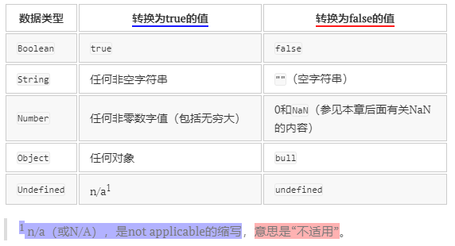

[TOC]


<div style="page-break-after: always;"></div>


## 第一章 JavaScript简介

#### 1.2 JavaScript实现：

##### 核心(ECMAScript): 

由ECMA-262定义的ECMAScript规定了：

​		语法，类型，语句，关键字，保留字，操作符，对象

##### 文档对象模型(DOM)

​		针对XML但扩展用于HTML的应用程序编程接口

DOM1级：有两个模块：

​			1. DOM核心（DOM Core）:　如何映射基于XML的文档结构,简化对文档的操作和访问。

​			2. DOM HTML：扩展DOM核心，添加针对HTML的对象和语法

DOM2级：扩充鼠标和用户界面事件，范围，遍历等细分模块，增加对CSS的支持。DOM1级中的DOM核心模块经过扩展开始支持XML命名空间。

给出新类型和新接口的定义。

DOM视图：定义了跟踪不同文档视图的接口

DOM事件：定义了事件和事件处理的接口

DOM样式：定义了基于CSS为元素应用样式的接口

DOM遍历和范围：定义了遍历和操作文档树的接口

##### 浏览器对象模型(BOM)			


<div style="page-break-after: always;"></div>


## 3.5.3 布尔操作符

逻辑非由一个（！）表示。逻辑非操作符首先会将它的操作数转换为一个布尔值，然后对其求反。



- 如果操作数是一个对象，返回`false`；
- 如果操作数是一个空字符串，返回`true`；
- 如果操作数是一个非空字符串，返回`false`；
- 如果操作数是数值0，返回`true`；
- 如果操作数是任意非0数值（包括`Infinity`），返回`false`；
- 如果操作数是`null`，返回`true`；
- 如果操作数是`NaN`，返回`true`；
- 如果操作数是`undefined`，返回`true`。

下面几个例子展示了应用上述规则的结果：

```
alert(!false);          // true
alert(!"blue");         // false
alert(!0);              // true
alert(!NaN);            // true
alert(!"");             // true
alert(!12345);          // false
```