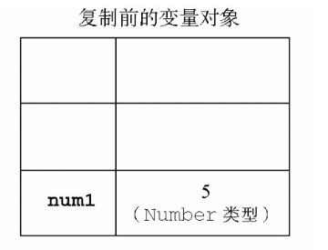
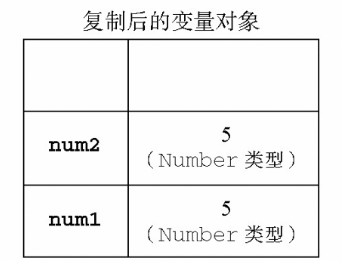
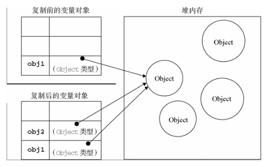

## JavaScript高级程序设计

### 第1章：JavaScript简介

#### 1.2 JavaScript实现：

一个完整的JavaScript实现应该由下列三个不同的部分组成:


##### 核心(ECMAScript): 

由ECMA-262定义的ECMAScript规定了：

​		语法，类型，语句，关键字，保留字，操作符，对象

##### 文档对象模型(DOM)

​		针对XML但扩展用于HTML的应用程序编程接口

DOM1级：有两个模块：

​			1. DOM核心（DOM Core）:　如何映射基于XML的文档结构,简化对文档的操作和访问。

​			2. DOM HTML：扩展DOM核心，添加针对HTML的对象和语法

DOM2级：扩充鼠标和用户界面事件，范围，遍历等细分模块，增加对CSS的支持。DOM1级中的DOM核心模块经过扩展开始支持XML命名空间。

给出新类型和新接口的定义。

DOM视图：定义了跟踪不同文档视图的接口

DOM事件：定义了事件和事件处理的接口

DOM样式：定义了基于CSS为元素应用样式的接口

DOM遍历和范围：定义了遍历和操作文档树的接口

##### 浏览器对象模型(BOM)			

从根本上讲，BOM只处理浏览器窗口和框架；但人们习惯上也把所有针对浏览器的JavaScript扩展算作BOM的一部分。

下面就是一些这样的扩展：

- 弹出新浏览器窗口的功能；
- 移动、缩放和关闭浏览器窗口的功能；
- 提供浏览器详细信息的`navigator`对象；
- 提供浏览器所加载页面的详细信息的`location`对象；
- 提供用户显示器分辨率详细信息的`screen`对象；
- 对cookies的支持；
- 像`XMLHttpRequest`和IE的`ActiveXObject`这样的自定义对象。

#### 1.4 小结

- ECMAScript，由ECMA-262定义，提供核心语言功能；
- 文档对象模型（DOM），提供访问和操作网页内容的方法和接口；
- 浏览器对象模型（BOM），提供与浏览器交互的方法和接口。

### 第2章：html中使用JavaScript

#### 2.1`<script>`标签

向HTML页面中插入JavaScript的主要方法，就是使用`<script>`元素。

使用`<script>`元素的方式有两种：直接在页面中嵌入JavaScript代码和包含外部JavaScript文件。

在使用`<script>`元素嵌入JavaScript代码时，只须为`<script>`指定`type`属性。然后，像下面这样把JavaScript代码直接放在元素内部即可：

```
<script type="text/javascript">
    function sayHi(){ 
        alert("Hi!");
    }
</script>
```

要通过`<script>`元素来包含外部JavaScript文件，那么`src`属性就是必需的。这个属性的值是一个指向外部JavaScript文件的链接，例如：

```
<script type="text/javascript" src="example.js"></script>
```

所有`<script>`元素都会按照它们在页面中出现的先后顺序依次被解析。在不使用`defer`和`async`属性的情况下，只有在解析完前面`<script>`元素中的代码之后，才会开始解析后面`<script>`元素中的代码。

#### 2.5 小结

把JavaScript插入到HTML页面中要使用`<script>`元素。使用这个元素可以把JavaScript嵌入到HTML页面中，让脚本与标记混合在一起；也可以包含外部的JavaScript文件。而我们需要注意的地方有：

- 在包含外部JavaScript文件时，必须将`src`属性设置为指向相应文件的URL。而这个文件既可以是与包含它的页面位于同一个服务器上的文件，也可以是其他任何域中的文件。
- 所有`<script>`元素都会按照它们在页面中出现的先后顺序依次被解析。在不使用`defer`和`async`属性的情况下，只有在解析完前面`<script>`元素中的代码之后，才会开始解析后面`<script>`元素中的代码。
- 由于浏览器会先解析完不使用`defer`属性的`<script>`元素中的代码，然后再解析后面的内容，所以一般应该把`<script>`元素放在页面最后，即主要内容后面，`</body>`标签前面。
- 使用`defer`属性可以让脚本在文档完全呈现之后再执行。延迟脚本总是按照指定它们的顺序执行。
- 使用`async`属性可以表示当前脚本不必等待其他脚本，也不必阻塞文档呈现。不能保证异步脚本按照它们在页面中出现的顺序执行。

另外，使用`<noscript>`元素可以指定在不支持脚本的浏览器中显示的替代内容。但在启用了脚本的情况下，浏览器不会显示`<noscript>`元素中的任何内容。

### 第3章：基本概念

#### 3.1语法

- ##### 区分大小写

ECMAScript中的一切（变量、函数名和操作符）都区分大小写。

- ##### 标识符

标识符，就是指变量、函数、属性的名字，或者函数的参数。

- 第一个字符必须是一个字母、下划线（`_`）或一个美元符号（`$`）；
- 其他字符可以是字母、下划线、美元符号或数字。

不能把关键字、保留字、**`true`**、**`false`**和**`null`**用作标识符。

##### **3.1.3　注释**

```
// 单行注释
```

块级注释以一个斜杠和一个星号（`/*`）开头，以一个星号和一个斜杠（`*/`）结尾，如下所示：

```
/*
 *  这是一个多行
 *  （块级）注释
 */
```

##### **3.1.4　严格模式**

要在整个脚本中启用严格模式，可以在顶部添加如下代码：

```
"use strict";
```

在函数内部的上方包含这条编译指示，也可以指定函数在严格模式下执行：

```
function doSomething(){
    "use strict"; 
    //函数体
}
```

#### 3.3  变量

每个变量仅仅是一个用于保存值的占位符而已。

定义变量时要使用`var`操作符（注意`var`是一个关键字），后跟变量名（即一个标识符）

```
var message;
```

使用`var`操作符定义的变量将成为定义该变量的作用域中的局部变量。

也就是说，如果在函数中使用`var`定义一个变量，那么这个变量在函数退出后就会被销毁。

```
function test(){
    var message = "hi"; // 局部变量
}
test();
alert(message); // 错误！
```

严格模式下，不能定义名为`eval`或`arguments`的变量，否则会导致语法错误

#### 3.4  数据类型

ECMAScript中有5种简单数据类型（也称为基本数据类型）：`Undefined`、`Null`、`Boolean`、`Number`和`String`。

还有1种复杂数据类型——`Object`，`Object`本质上是由一组无序的名值对组成的。

##### **3.4.1　`typeof`操作符**

鉴于ECMAScript是松散类型的，因此需要有一种手段来检测给定变量的数据类型——`typeof`就是负责提供这方面信息的操作符。

对一个值使用`typeof`操作符可能返回下列某个字符串：

- `"undefined"`——如果这个值未定义；
- `"boolean"`——如果这个值是布尔值；
- `"string"`——如果这个值是字符串；
- `"number"`——如果这个值是数值；
- `"object"`——如果这个值是对象或`null`；
- `"function"`——如果这个值是函数。

`typeof`操作符的操作数可以是变量（`message`），也可以是数值字面量。

注意，`typeof`是一个操作符而不是函数。

##### **3.4.2　`Undefined`类型**

`Undefined`类型只有一个值，即特殊的`undefined`。

在使用`var`声明变量但未对其加以初始化时，这个变量的值就是`undefined`

包含`undefined`值的变量与尚未定义的变量还是不一样的。

例子：

```
var message; // 这个变量声明之后默认取得了undefined值

// 下面这个变量并没有声明
// var age

alert(message);     // "undefined"
alert(age);         // 产生错误
```

对于尚未声明过的变量，只能执行一项操作，即使用`typeof`操作符检测其数据类型。

对未初始化的变量执行`typeof`操作符会返回`undefined`值，而对未声明的变量执行`typeof`操作符同样也会返回`undefined`值。

##### **3.4.3　`Null`类型**

`Null`类型是第二个只有一个值的数据类型，这个特殊的值是`null`。

从逻辑角度来看，`null`值表示一个空对象指针，而这也正是使用`typeof`操作符检测`null`值时会返回`"object"`。

例子：

```
var car = null;
alert(typeof car);     // "object"
```

如果定义的变量准备在将来用于保存对象，那么最好将该变量初始化为`null`而不是其他值。

`undefined`值是派生自`null`值的，因此ECMA-262规定对它们的相等性测试要返回`true`：

```
alert(null == undefined);    //true
```

##### **3.4.4　`Boolean`类型**

`Boolean`类型只有两个字面值：`true`和`false`。

这两个值与数字值不是一回事，因此`true`不一定等于1，而`false`也不一定等于0。

`Boolean`类型的字面值`true`和`false`是区分大小写的。

`True`和`False`（以及其他的混合大小写形式）都不是`Boolean`值，只是标识符。

要将一个值转换为其对应的`Boolean`值，可以调用转型函数`Boolean()`


##### **3.4.5　`Number`类型**

最基本的数值字面量格式是十进制整数。

除了以十进制表示外，整数还可以通过八进制（以8为基数）或十六进制（以16为基数）的字面值来表示。

其中，八进制字面值的第一位必须是零（0），然后是八进制数字序列（0～7）

如果字面值中的数值超出了范围，那么前导零将被忽略，后面的数值将被当作十进制数值解析。

请看下面的例子：

```
var octalNum1 = 070;            // 八进制的56
var octalNum2 = 079;            // 无效的八进制数值——解析为79
var octalNum3 = 08;             // 无效的八进制数值——解析为8
```

十六进制字面值的前两位必须是0x，后跟任何十六进制数字（0～9及A～F）。其中，字母A～F可以大写，也可以小写。如下面的例子所示：

```
var hexNum1 = 0xA;              // 十六进制的10
var hexNum2 = 0x1f;             // 十六进制的31
```

1. **浮点数值**

对于那些极大或极小的数值，可以用e表示法（即科学计数法）表示的浮点数值表示。

用e表示法表示的数值等于e前面的数值乘以10的指数次幂。

浮点数值的最高精度是17位小数，但在进行算术计算时其精确度远远不如整数。

2. **数值范围**

ECMAScript能够表示的最小数值保存在`Number.MIN_VALUE`中——在大多数浏览器中，这个值是5e-324；

能够表示的最大数值保存在`Number.MAX_VALUE`中——在大多数浏览器中，这个值是1.7976931348623157e+308。

如果某次计算的结果得到了一个超出JavaScript数值范围的值，那么这个数值将被自动转换成特殊的`Infinity`值。

具体来说，如果这个数值是负数，则会被转换成`-Infinity`（负无穷），如果这个数值是正数，则会被转换成`Infinity`（正无穷）。

如果某次计算返回了正或负的`Infinity`值，那么该值将无法继续参与下一次的计算，因为`Infinity`不是能够参与计算的数值。

要想确定一个数值是不是有穷的（换句话说，是不是位于最小和最大的数值之间），可以使用`isFinite()`函数。

这个函数在参数位于最小与最大数值之间时会返回`true`，如下面的例子所示：

```
var result = Number.MAX_VALUE + Number.MAX_VALUE;
alert(isFinite(result));   //false
```

3. **`NaN`**

`NaN`，即非数值（Not a Number）是一个特殊的数值，这个数值用于表示一个本来要返回数值的操作数未返回数值的情况。

在ECMAScript中，任何数值除以0会返回`NaN`，因此不会影响其他代码的执行。

`NaN`与任何值都不相等，包括`NaN`本身。

例如，下面的代码会返回`false`：

```
alert(NaN == NaN);      //false
```

针对`NaN`的这两个特点，ECMAScript定义了`isNaN()`函数。

这个函数接受一个参数，该参数可以是任何类型，而函数会帮我们确定这个参数是否“不是数值”。

```
alert(isNaN(NaN));              //true
alert(isNaN(10));               //false（10是一个数值）
alert(isNaN("10"));             //false（可以被转换成数值10）
alert(isNaN("blue"));           //true（不能转换成数值）
alert(isNaN(true));             //false（可以被转换成数值1）
```

由于`Boolean`值`true`可以转换成数值1，因此函数返回`false`。

4. **数值转换**

有3个函数可以把非数值转换为数值：`Number()`、`parseInt()`和`parseFloat()`。

**Number()函数**

`Number()`函数的转换规则如下。

- 如果是`Boolean`值，`true`和`false`将分别被转换为1和0。

- 如果是数字值，只是简单的传入和返回。

- 如果是`null`值，返回0。

  - 如果是`undefined`，返回`NaN`。
  - 如果是字符串，遵循下列规则：
    - 如果字符串中只包含数字（包括前面带加号或头号的情况），则将其转换为十进制数值，即`"1"`会变成1，`"123"`会变成123，而`"011"`会变成11（注意：前导的零被忽略了）；
    - 如果字符串中包含有效的浮点格式，如`"1.1"`，则将其转换为对应的浮点数值（同样，也会忽略前导零）；
    - 如果字符串中包含有效的十六进制格式，例如`"0xf"`，则将其转换为相同大小的十进制整数值；
    - 如果字符串是空的（不包含任何字符），则将其转换为0；
    - 如果字符串中包含除上述格式之外的字符，则将其转换为`NaN`。
  - 如果是对象，则调用对象的`valueOf()`方法，然后依照前面的规则转换返回的值。如果转换的结果是`NaN`，则调用对象的`toString()`方法，然后再次依照前面的规则转换返回的字符 串值。

  ```
  var num1 = Number("Hello world!");      //NaN
  var num2 = Number("");                  //0
  var num3 = Number("000011");            //11
  var num4 = Number(true);                //1
  ```

由于`Number()`函数在转换字符串时比较复杂而且不够合理，因此在处理整数的时候更常用的是`parseInt()`函数。

**parseInt()函数**

用`parseInt()`转换空字符串会返回`NaN`（`Number()`对空字符返回0）。

如果字符串中的第一个字符是数字字符，`parseInt()`也能够识别出各种整数格式（十进制、八进制和十六进制数）。

也就是说，如果字符串以`"0x"`开头且后跟数字字符，就会将其当作一个十六进制整数；

如果字符串以`"0"`开头且后跟数字字符，则会将其当作一个八进制数来解析。

```
var num1 = parseInt("1234blue");        // 1234
var num2 = parseInt("");                // NaN
var num3 = parseInt("0xA");             // 10（十六进制数）
var num4 = parseInt(22.5);              // 22
var num5 = parseInt("070");             // 56（八进制数）
var num6 = parseInt("70");              // 70（十进制数）
var num7 = parseInt("0xf");             // 15（十六进制数）
```

在ECMAScript 3 JavaScript引擎中，`"070"`被当成八进制字面量，因此转换后的值是十进制的56。

而在ECMAScript 5 JavaScript引擎中，`parseInt()`已经不具有解析八进制值的能力，因此前导的零会被认为无效，从而将这个值当成`"0"`，结果就得到十进制的0。

为了消除在使用`parseInt()`函数时可能导致的上述困惑，可以为这个函数提供第二个参数：转换时使用的基数（即多少进制）。

如果知道要解析的值是十六进制格式的字符串，那么指定基数16作为第二个参数，可以保证得到正确的结果，例如：

```
var num = parseInt("0xAF", 16);         //175
//如果指定了16作为第二个参数，字符串可以不带前面的"0x"
var num1 = parseInt("AF", 16);          //175
var num2 = parseInt("AF");              //NaN
```

```
var num1 = parseInt("10", 2);           //2   （按二进制解析）
var num2 = parseInt("10", 8);           //8   （按八进制解析）
var num3 = parseInt("10", 10);          //10  （按十进制解析）
var num4 = parseInt("10", 16);          //16  （按十六进制解析）
```

建议无论在什么情况下都明确指定基数。

**parseFloat()函数**

`parseFloat()`也是从第一个字符（位置0）开始解析每个字符。而且也是一直解析到字符串末尾，或者解析到遇见一个无效的浮点数字字符为止。

除了第一个小数点有效之外，`parseFloat()`与`parseInt()`的第二个区别在于它始终都会忽略前导的零。

`parseFloat()`可以识别前面讨论过的所有浮点数值格式，也包括十进制整数格式。但十六进制格式的字符串则始终会被转换成0。

```
var num1 = parseFloat("1234blue");              //1234 （整数）
var num2 = parseFloat("0xA");                   //0
var num3 = parseFloat("22.5");                  //22.5
var num4 = parseFloat("22.34.5");               //22.34
var num5 = parseFloat("0908.5");                //908.5
var num6 = parseFloat("3.125e7");               //31250000
```

##### **3.4.6　`String`类型**

要把一个值转换为一个字符串有两种方式。第一种是使用几乎每个值都有的`toString()`方法。

这个方法唯一要做的就是返回相应值的字符串表现。

`toString()`方法以十进制格式返回数值的字符串表示。

而通过传递基数，`toString()`可以输出以二进制、八进制、十六进制，乃至其他任意有效进制格式表示的字符串值。

例子：

```
var num = 10;
alert(num.toString());          // "10"
alert(num.toString(2));         // "1010"
alert(num.toString(8));         // "12"
alert(num.toString(10));        // "10"
alert(num.toString(16));        // "a"
```

##### **3.4.7　`Object`类型**

ECMAScript中的对象其实就是一组数据和功能的集合。对象可以通过执行`new`操作符后跟要创建的对象类型的名称来创建。

创建`Object`类型的实例并为其添加属性和（或）方法，就可以创建自定义对象，如下所示：

```
var o = new Object();
```

`Object`类型是所有它的实例的基础。

`Object`类型所具有的任何属性和方法也同样存在于更具体的对象中。

`Object`的每个实例都具有下列属性和方法。

- `Constructor`：保存着用于创建当前对象的函数。对于前面的例子而言，构造函数（constructor）就是`Object()`。
- `hasOwnProperty(propertyName)`：用于检查给定的属性在当前对象实例中（而不是在实例的原型中）是否存在。其中，作为参数的属性名（`propertyName`）必须以字符串形式指定（例如：`o.hasOwnProperty("name")`）。
- `isPrototypeOf(object)`：用于检查传入的对象是否是另一个对象的原型（第5章将讨论原型）。
- `propertyIsEnumerable(propertyName)`：用于检查给定的属性是否能够使用`for-in`语句（本章后面将会讨论）来枚举。与`hasOwnProperty()`方法一样，作为参数的属性名必须以字符串形式指定。
- `toLocaleString()`：返回对象的字符串表示，该字符串与执行环境的地区对应。
- `toString()`：返回对象的字符串表示。
- `valueOf()`：返回对象的字符串、数值或布尔值表示。通常与`toString()`方法的返回值相同。

#### 3.5  操作符

用于操作数据值：**操作符**，包括算术操作符（如加号和减号）、位操作符、关系操作符和相等操作符。

##### **3.5.1　一元操作符**

只能操作一个值的操作符叫做**一元操作符**。

1. **递增和递减操作符**

前置型应该位于要操作的变量之前，而后置型则应该位于要操作的变量之后。

使用前置递减操作符时，要把两个减号（`--`）放在相应变量的前面，前置递增和递减操作时，变量的值都是在语句被求值以前改变的。

```
var age = 29;
var anotherAge = --age + 2;

alert(age);             // 输出28
alert(anotherAge);      // 输出30
```

后置型递增和递减操作符的语法不变（仍然分别是`++`和`--`）递增和递减操作是在包含它们的语句被求值之后才执行的。

```
var num1 = 2;
var num2 = 20;
var num3 = num1-- + num2;       // 等于22
var num4 = num1 + num2;         // 等于21
```

所有这4个操作符对任何值都适用，也就是它们不仅适用于整数，还可以用于字符串、布尔值、浮点数值和对象。在应用于不同的值时，递减和递减操作符遵循下列规则。

- 在应用于一个**包含**有效数字字符的字符串时，先将其转换为数字值，再执行加减1的操作。字符串变量变成数值变量。
- 在应用于一个**不包含**有效数字字符的字符串时，将变量的值设置为`NaN`（第4章将详细讨论）。字符串变量变成数值变量。
- 在应用于**布尔值`false`时**，先将其转换为0再执行加减1的操作。布尔值变量变成数值变量。
- 在应用于**布尔值`true`时**，先将其转换为1再执行加减1的操作。布尔值变量变成数值变量。
- 在应用于浮点数值时，执行加减1的操作。
- 在应用于**对象**时，**先调用对象的valueOf()方法**（第5章将详细讨论）以取得一个可供操作的值。然后对该值应用前述规则。如果结果是`NaN`，则在调用`toString()`方法后再应用前述规则。对象变量变成数值变量。

以下示例展示了上面的一些规则：

```
var s1 = "2";
var s2 = "z";
var b = false;
var f = 1.1;
var o = { 
 valueOf: function() {
        return -1;
    }
};

s1++;     // 值变成数值3
s2++;     // 值变成NaN
b++;      // 值变成数值1
f--;      // 值变成0.10000000000000009（由于浮点舍入错误所致）
o--;      // 值变成数值-2
```

2. **一元加和减操作符**

对不同数据类型应用一元加操作符的结果：

```
var s1 = "01";
var s2 = "1.1";
var s3 = "z";
var b = false;
var f = 1.1;
var o = {
    valueOf: function() {
        return -1;
    }
};

s1 = +s1;        // 值变成数值1
s2 = +s2;        // 值变成数值1.1
s3 = +s3;        // 值变成NaN
b = +b;          // 值变成数值0
f = +f;          // 值未变，仍然是1.1
o = +o;          // 值变成数值-1
```

一元减操作符主要用于表示负数，例如将1转换成-1。

##### **3.5.2　位操作符**

位操作符并不直接操作64位的值。

而是先将64位的值转换成32位的整数，然后执行操作，最后再将结果转换回64位。对于开发人员来说，由于64位存储格式是透明的，因此整个过程就像是只存在32位的整数一样。

对于有符号的整数，32位中的前31位用于表示整数的值。

第32位用于表示数值的符号：0表示正数，1表示负数。

这个表示符号的位叫做**符号位**，符号位的值决定了其他位数值的格式。

负数同样以二进制码存储，但使用的格式是**二进制补码**。

要根据这3个步骤求得-18的二进制码，首先就要求得18的二进制码

然后，求其二进制反码，即0和1互换：

在对特殊的`NaN`和`Infinity`值应用位操作时，这两个值都会被当成0来处理。

1. **按位非（NOT）**

按位非操作符由一个波浪线**（~）**表示，执行按位非的结果就是返回数值的反码。

参考：https://www.cnblogs.com/xiaoanbucai/p/14240108.html

2. **按位与（AND）**

按位与操作符由一个和号字符**（&）**表示，它有两个操作符数。

按位与操作只在两个数值的对应位都是1时才返回1，任何一位是0，结果都是0。

3. **按位或（OR）**

按位或操作符由一个竖线符号**（|）**表示，同样也有两个操作数。

按位或操作在有一个位是1的情况下就返回1，而只有在两个位都是0的情况下才返回0。

4. **按位异或（XOR）**

按位异或操作符由一个插入符号**（^）**表示，也有两个操作数。

按位异或与按位或的不同之处在于，这个操作在两个数值对应位上只有一个1时才返回1，如果对应的两位都是1或都是0，则返回0。

5. **左移**

左移操作符由两个小于号**（<<）**表示，这个操作符会将数值的所有位向左移动指定的位数。

在向左移位后，原数值的右侧多出了5个空位。左移操作会以0来填充这些空位，以便得到的结果是一个完整的32位二进制数。


左移不会影响操作数的符号位。

6. **有符号的右移**

有符号的右移操作符由两个大于号**（>>）**表示，这个操作符会将数值向右移动，但保留符号位（即正负号标记）。

在移位过程中，原数值中也会出现空位。

而此时ECMAScript会用符号位的值来填充所有空位，以便得到一个完整的值。


7. **无符号右移**

无符号右移操作符由3个大于号**（>>>）**表示，这个操作符会将数值的所有32位都向右移动。

无符号右移是以0来填充空位，而不是像有符号右移那样以符号位的值来填充空位。

**无符号右移操作符会把负数的二进制码当成正数的二进制码。**而且，由于负数以其绝对值的二进制补码形式表示，因此就会导致无符号右移后的结果非常之大，如下面的例子所示：

```
var oldValue = 64;    // 等于二进制的1000000
var newValue = oldValue >>> 5;   // 等于二进制的10 ，即十进制的2
```

```
var oldValue = -64; // 等于二进制的11111111111111111111111111000000
var newValue = oldValue >>> 5; // 等于十进制的134217726
```

##### 3.5.3 布尔操作符

1. **逻辑非**

逻辑非由一个**（！）**表示。逻辑非操作符首先会将它的操作数转换为一个布尔值，然后对其求反。


- 如果操作数是一个对象，返回`false`；
- 如果操作数是一个空字符串，返回`true`；
- 如果操作数是一个非空字符串，返回`false`；
- 如果操作数是数值0，返回`true`；
- 如果操作数是任意非0数值（包括`Infinity`），返回`false`；
- 如果操作数是`null`，返回`true`；
- 如果操作数是`NaN`，返回`true`；
- 如果操作数是`undefined`，返回`true`。

下面几个例子展示了应用上述规则的结果：

```
alert(!false);          // true
alert(!"blue");         // false
alert(!0);              // true
alert(!NaN);            // true
alert(!"");             // true
alert(!12345);          // false
```

逻辑非操作符也可以用于将一个值转换为与其对应的布尔值。

2. **逻辑与**

逻辑与操作符由两个和号**（`&&`）**表示.

逻辑与操作可以应用于任何类型的操作数，而不仅仅是布尔值。

在有一个操作数不是布尔值的情况下，逻辑与操作就不一定返回布尔值；

此时，它遵循下列规则：

- 如果第一个操作数是对象，则返回第二个操作数；
- 如果第二个操作数是对象，则只有在第一个操作数的求值结果为`true`的情况下才会返回该对象；
- 如果两个操作数都是对象，则返回第二个操作数；
- 如果有一个操作数是`null`，则返回`null`；
- 如果有一个操作数是`NaN`，则返回`NaN`；
- 如果有一个操作数是`undefined`，则返回`undefined`。

逻辑与操作属于短路操作，即如果第一个操作数能够决定结果，那么就不会再对第二个操作数求值。对于**逻辑与操作而言，如果第一个操作数是`false`，则无论第二个操作数是什么值，结果都不再可能是`true`**了。

不能在逻辑与操作中使用未定义的值。

3. **逻辑或**

逻辑或操作符由两个竖线符号**（||）**表示，

与逻辑与操作相似，如果有一个操作数不是布尔值，逻辑或也不一定返回布尔值；此时，它遵循下列规则：

- 如果第一个操作数是对象，则返回第一个操作数；
- 如果第一个操作数的求值结果为`false`，则返回第二个操作数；
- 如果两个操作数都是对象，则返回第一个操作数；
- 如果两个操作数都是`null`，则返回`null`；
- 如果两个操作数都是`NaN`，则返回`NaN`；
- 如果两个操作数都是`undefined`，则返回`undefined`。

与逻辑与操作符相似，逻辑或操作符也是短路操作符。

也就是说，如果第一个操作数的求值结果为`true`，就不会对第二个操作数求值了。

我们可以利用逻辑或的这一行为来避免为变量赋`null`或`undefined`值。例如：

```
var myObject = preferredObject || backupObject;
```

变量`myObject`将被赋予等号后面两个值中的一个。

变量`preferredObject`中包含优先赋给变量`myObject`的值，

变量`backupObject`负责在`preferredObject`中不包含有效值的情况下提供后备值。

如果`preferredObject`的值不是`null`，那么它的值将被赋给`myObject`；

如果是`null`，则将`backupObject`的值赋给`myObject`。

##### **3.5.4　乘性操作符**

ECMAScript定义了3个乘性操作符：乘法、除法和求模。

在操作数为非数值的情况下会执行自动的类型转换。

如果参与乘法计算的某个操作数不是数值，后台会先使用`Number()`转型函数将其转换为数值。

也就是说，空字符串将被当作0，布尔值`true`将被当作1。

1. **乘法**

乘法操作符由一个星号**（*）**表示，用于计算两个数值的乘积。

在处理特殊值的情况下，乘法操作符遵循下列特殊的规则：

- 如果操作数都是数值，执行常规的乘法计算，即两个正数或两个负数相乘的结果还是正数，而如果只有一个操作数有符号，那么结果就是负数。

  如果乘积超过了ECMAScript数值的表示范围，则返回`Infinity`或`-Infinity`；

- 如果有一个操作数是`NaN`，则结果是`NaN`；

- 如果是`Infinity`与0相乘，则结果是`NaN`；

- 如果是`Infinity`与非0数值相乘，则结果是`Infinity`或`-Infinity`，取决于有符号操作数的符号；

- 如果是`Infinity`与`Infinity`相乘，则结果是`Infinity`；

- 如果有一个操作数不是数值，则在后台调用`Number()`将其转换为数值，然后再应用上面的规则。

2. **除法**

除法操作符由一个斜线符号**（/）**表示，执行第二个操作数除第一个操作数的计算。

与乘法操作符类似，除法操作符对特殊的值也有特殊的处理规则。

这些规则如下：

- 如果操作数都是数值，执行常规的除法计算，即两个正数或两个负数相除的结果还是正数，而如果只有一个操作数有符号，那么结果就是负数。如果商超过了ECMAScript数值的表示范围，则返回`Infinity`或`-Infinity`；
- 如果有一个操作数是`NaN`，则结果是`NaN`；
- 如果是`Infinity`被`Infinity`除，则结果是`NaN`；
- 如果是零被零除，则结果是`NaN`；
- 如果是非零的有限数被零除，则结果是`Infinity`或`-Infinity`，取决于有符号操作数的符号；
- 如果是`Infinity`被任何非零数值除，则结果是`Infinity`或`-Infinity`，取决于有符号操作数的符号；
- 如果有一个操作数不是数值，则在后台调用`Number()`将其转换为数值，然后再应用上面的规则。

3. **求模**

求模（余数）操作符由一个百分号**（`%`）**表示。

求模操作符会遵循下列特殊规则来处理特殊的值：

- 如果操作数都是数值，执行常规的除法计算，返回除得的余数；

- 如果被除数是无穷大值而除数是有限大的数值，则结果是`NaN`；
- 如果被除数是有限大的数值而除数是零，则结果是`NaN`；
- 如果是`Infinity`被`Infinity`除，则结果是`NaN`；
- 如果被除数是有限大的数值而除数是无穷大的数值，则结果是被除数；
- 如果被除数是零，则结果是零；
- 如果有一个操作数不是数值，则在后台调用`Number()`将其转换为数值，然后再应用上面的规则。

##### **3.5.5　加性操作符**

1. **加法**

如果两个操作符都是数值，执行常规的加法计算，然后根据下列规则返回结果：

- 如果有一个操作数是`NaN`，则结果是`NaN`；
- 如果是`Infinity`加`Infinity`，则结果是`Infinity`；

- 如果是`-Infinity`加`-Infinity`，则结果是`-Infinity`；
- 如果是`Infinity`加`-Infinity`，则结果是`NaN`；
- 如果是+0加+0，则结果是+0；
- 如果是-0加-0，则结果是-0；
- 如果是+0加-0，则结果是+0。

不过，如果有一个操作数是字符串，那么就要应用如下规则：

- 如果两个操作数都是字符串，则将第二个操作数与第一个操作数拼接起来；
- 如果只有一个操作数是字符串，则将另一个操作数转换为字符串，然后再将两个字符串拼接 起来。

如果有一个操作数是对象、数值或布尔值，则调用它们的`toString()`方法取得相应的字符串值，然后再应用前面关于字符串的规则。对于`undefined`和`null`，则分别调用`String()`函数并取得字符串`"undefined"`和`"null"`。

2. **减法**

减法操作符在处理各种数据类型转换时，同样需要遵循一些特殊规则，如下所示：

- 如果两个操作符都是数值，则执行常规的算术减法操作并返回结果；
- 如果有一个操作数是`NaN`，则结果是`NaN`
- 如果是`Infinity`减`Infinity`，则结果是`NaN`；
- 如果是`-Infinity`减`-Infinity`，则结果是`NaN`；
- 如果是`Infinity`减`-Infinity`，则结果是`Infinity`；
- 如果是`-Infinity`减`Infinity`，则结果是`-Infinity`；
- 如果是+0减+0，则结果是+0；
- 如果是+0减-0，则结果是-0；
- 如果是-0减-0，则结果是+0；
- 如果有一个操作数是字符串、布尔值、`null`或`undefined`，则先在后台调用`Number()`函数将其转换为数值，然后再根据前面的规则执行减法计算。如果转换的结果是`NaN`，则减法的结果就是`NaN`；
- 如果有一个操作数是对象，则调用对象的`valueOf()`方法以取得表示该对象的数值。如果得到的值是`NaN`，则减法的结果就是`NaN`。如果对象没有`valueOf()`方法，则调用其`toString()`方法并将得到的字符串转换为数值。

```
var result1 = 5 - true;         // 4，因为true被转换成了1
var result2 = NaN - 1;          // NaN
var result3 = 5 - 3;            // 2
var result4 = 5 - "";           // 5，因为"" 被转换成了0
var result5 = 5 - "2";          // 3，因为"2"被转换成了2
var result6 = 5 - null;         // 5，因为null被转换成了0
```

##### **3.5.6　关系操作符**

小于（<）、大于（>）、小于等于（<=）和大于等于（>=）这几个关系操作符用于对两个值进行比较，比较的规则与我们在数学课上所学的一样。

与ECMAScript中的其他操作符一样，当关系操作符的操作数使用了非数值时，也要进行数据转换或完成某些奇怪的操作。以下就是相应的规则。

- 如果两个操作数都是数值，则执行数值比较。
- 如果两个操作数都是字符串，则比较两个字符串对应的字符编码值。
- 如果一个操作数是数值，则将另一个操作数转换为一个数值，然后执行数值比较。
- 如果一个操作数是对象，则调用这个对象的`valueOf()`方法，用得到的结果按照前面的规则执行比较。如果对象没有`valueOf()`方法，则调用`toString()`方法，并用得到的结果根据前面的规则执行比较。
- 如果一个操作数是布尔值，则先将其转换为数值，然后再执行比较。

由于大写字母的字符编码全部小于小写字母的字符编码，因此我们就会看到如下所示的奇怪现象：

```
var result = "Brick" < "alphabet";    //true
```

在这个例子中，字符串`"Brick"`被认为小于字符串`"alphabet"`。

原因是字母B的字符编码为66，而字母a的字符编码是97。

如果要真正按字母表顺序比较字符串，就必须把两个操作数转换为相同的大小写形式（全部大写或全部小写），然后再执行比较。

任何操作数与`NaN`进行关系比较，结果都是`false`。

##### **3.5.7　相等操作符**

**相等**和**不相等**——先转换再比较，**全等**和**不全等**——仅比较而不转换。

1. **相等和不相等**

ECMAScript中的相等操作符由两个等于号**（==）**表示，如果两个操作数相等，则返回`true`。

而不相等操作符由叹号后跟等于号**（!=）**表示，如果两个操作数不相等，则返回`true`。

这两个操作符都会先转换操作数（通常称为**强制转型**），然后再比较它们的相等性。

在转换不同的数据类型时，相等和不相等操作符遵循下列基本规则：

- 如果有一个操作数是布尔值，则在比较相等性之前先将其转换为数值——`false`转换为0，而`true`转换为1；
- 如果一个操作数是字符串，另一个操作数是数值，在比较相等性之前先将字符串转换为数值；
- 如果一个操作数是对象，另一个操作数不是，则调用对象的`valueOf()`方法，用得到的基本类型值按照前面的规则进行比较；

这两个操作符在进行比较时则要遵循下列规则。

- `null`和`undefined`是相等的。
- 要比较相等性之前，不能将`null`和`undefined`转换成其他任何值。
- 如果有一个操作数是`NaN`，则相等操作符返回`false`，而不相等操作符返回`true`。重要提示：即使两个操作数都是`NaN`，相等操作符也返回`false`；因为按照规则，`NaN`不等于`NaN`。
- 如果两个操作数都是对象，则比较它们是不是同一个对象。如果两个操作数都指向同一个对象，则相等操作符返回`true`；否则，返回`false`。

下表列出了一些特殊情况及比较结果：

| 表　达　式          | 值      | 表　达　式       | 值      |
| ------------------- | ------- | ---------------- | ------- |
| `null == undefined` | `true`  | `true == 1`      | `true`  |
| `"NaN" == NaN`      | `false` | `true == 2`      | `false` |
| `5 == NaN`          | `false` | `undefined == 0` | `false` |
| `NaN == NaN`        | `false` | `null == 0`      | `false` |
| `NaN != NaN`        | `true`  | `"5"==5`         | `true`  |
| `false == 0`        | `true`  |                  |         |

2. **全等和不全等**

全等操作符由3个等于号（`===`）表示，它只在两个操作数未经转换就相等的情况下返回`true`，如下面的例子所示：

```
var result1 = ("55" == 55);     //true，因为转换后相等
var result2 = ("55" === 55);    //false，因为不同的数据类型不相等
```

不全等操作符由一个叹号后跟两个等于号（`!==`）表示，它在两个操作数未经转换就不相等的情况下返回`true`。

```
var result1 = ("55" != 55);     //false，因为转换后相等
var result2 = ("55" !== 55);    //true，因为不同的数据类型不相等
```

记住：`null == undefined`会返回`true`，因为它们是类似的值；但`null === undefined`会返回`false`，因为它们是不同类型的值。

##### **3.5.8　条件操作符**

它遵循与Java中的条件操作符相同的语法形式，如下面的例子所示：

```
variable = boolean_expression ? true_value : false_value;
```

##### **3.5.9　赋值操作符**

简单的赋值操作符由等于号（`=`）表示，其作用就是把右侧的值赋给左侧的变量，如下面的例子所示：

```
var num = 10;
```

每个主要算术操作符（以及个别的其他操作符）都有对应的复合赋值操作符。这些操作符如下所示：

- 乘/赋值（`*=`）；
- 除/赋值（`/=`）；
- 模/赋值（`%=`）；
- 加/赋值（`+=`）；
- 减/赋值（`-=`）；
- 左移/赋值（`<<=`）；

- 有符号右移/赋值（`>>=`）；
- 无符号右移/赋值（`>>>=`）。

##### **3.5.10　逗号操作符**

使用逗号操作符可以在一条语句中执行多个操作，如下面的例子所示：

```
var num1=1, num2=2, num3=3;
```

逗号操作符多用于声明多个变量；但除此之外，逗号操作符还可以用于赋值。在用于赋值时，逗号操作符总会返回表达式中的最后一项，如下面的例子所示：

```
var num = (5, 1, 4, 8, 0); // num的值为0
```

#### 3.6　语句

语句通常使用一或多个关键字来完成给定任务。

##### **3.6.1　`if`语句**

以下是`if`语句的语法：

```
if (i > 25)
    alert("Greater than 25.");                  // 单行语句
else {
    alert("Less than or equal to 25.");         // 代码块中的语句
}
```

##### **3.6.2　`do-while`语句**

`do-while`语句是一种后测试循环语句，即只有在循环体中的代码执行之后，才会测试出口条件。

在对条件表达式求值之前，循环体内的代码至少会被执行一次。

```
var i = 0;
do {
   i += 2;
} while (i < 10);

alert(i);
```

##### **3.6.3　`while`语句**

`while`语句属于前测试循环语句，也就是说，在循环体内的代码被执行之前，就会对出口条件求值。因引，循环体内的代码有可能永远不会被执行。

```
var i = 0;
while (i < 10) {
 i += 2;
}
```

##### **3.6.4　`for`语句**

`for`语句也是一种前测试循环语句，但它具有在执行循环之前初始化变量和定义循环后要执行的代码的能力。

```
var count = 10;
for (var i = 0; i < count; i++){
    alert(i);
}
```

使用`while`循环做不到的，使用`for`循环同样也做不到。

##### **3.6.5　`for-in`语句**

`for-in`语句是一种精准的迭代语句，可以用来枚举对象的属性。

```
for (var propName in window) {
     document.write(propName);
}
```

如果表示要迭代的对象的变量值为`null`或`undefined`，`for-in`语句会抛出错误。

为了保证最大限度的兼容性，建议在使用`for-in`循环之前，先检测确认该对象的值不是`null`或`undefined`。

##### **3.6.6　`label`语句**

使用`label`语句可以在代码中添加标签，以便将来使用。以下是`label`语句的语法：

```
label: statement
```

下面是一个示例：

```
start: for (var i=0; i < count; i++) {
    alert(i); 
}
```

这个例子中定义的`start`标签可以在将来由`break`或`continue`语句引用。加标签的语句一般都要与`for`语句等循环语句配合使用。

##### **3.6.7　`break`和`continue`语句**

`break`和`continue`语句用于在循环中精确地控制代码的执行。

其中，`break`语句会立即退出循环，强制继续执行循环后面的语句。

而`continue`语句虽然也是立即退出循环，但退出循环后会从循环的顶部继续执行。

`break`和`continue`语句都可以与`label`语句联合使用，从而返回代码中特定的位置。这种联合使用的情况多发生在循环嵌套的情况下，如下面的例子所示：

```
var num = 0;

outermost:
for (var i=0; i < 10; i++) {
     for (var j=0; j < 10; j++) {
        if (i == 5 && j == 5) {
            break outermost;
        }
        num++;
    }
}

alert(num);    //55
```

在这个例子中，`outermost`标签表示外部的`for`语句。

##### **3.6.8　`with`语句**

`with`语句的作用是将代码的作用域设置到一个特定的对象中。

定义`with`语句的目的主要是为了简化多次编写同一个对象的工作，如下面的例子所示：

```
var qs = location.search.substring(1);
var hostName = location.hostname;
var url = location.href;
```

上面几行代码都包含`location`对象。如果使用`with`语句，可以把上面的代码改写成如下所示：

```
with(location){
    var qs = search.substring(1);
    var hostName = hostname;
    var url = href;
}
```

在这个重写后的例子中，使用`with`语句关联了`location`对象。

严格模式下不允许使用`with`语句，否则将视为语法错误。

##### **3.6.9　`switch`语句**

`switch`语句中的每一种情形（case）的含义是：“如果表达式等于这个值（value），则执行后面的语句（statement）”。

而`break`关键字会导致代码执行流跳出`switch`语句。

如果省略`break`关键字，就会导致执行完当前case后，继续执行下一个case。

最后的`default`关键字则用于在表达式不匹配前面任何一种情形的时候，执行机动代码（因此，也相当于一个`else`语句）。

#### 3.7　函数

函数对任何语言来说都是一个核心的概念。

函数使用function关键字来声明，后跟一组参数以及函数体。

函数基本语法如下所示：

```
function functionName(arg0, arg1,...,argN) {
    statements
}
```

函数可以通过其函数名来调用，后面还要加上一对圆括号和参数（圆括号中的参数如果有多个，可以用逗号隔开）

```
function sayHi(name, message) {
    alert("Hello " + name + "," + message);
}
```

调用`sayHi()`函数的代码如下所示：

```
sayHi("Nicholas", "how are you today?");
```

函数会在执行完`return`语句之后停止并立即退出。因此，位于`return`语句之后的任何代码都永远不会执行。例如：

```
function sum(num1, num2) {
    return num1 + num2;
    alert("Hello world");    // 永远不会执行
}
```

另外，`return`语句也可以不带有任何返回值。

在这种情况下，函数在停止执行后将返回`undefined`值。

这种用法一般用在需要提前停止函数执行而又不需要返回值的情况下。

严格模式对函数有一些限制：

- 不能把函数命名为`eval`或`arguments`；
- 不能把参数命名为`eval`或`arguments`；
- 不能出现两个命名参数同名的情况。

如果发生以上情况，就会导致语法错误，代码无法执行。

- [x] ECMAScript中的所有参数传递的都是值，不可能通过引用传递参数。

##### **3.7.2　没有重载**

ECMAScript函数不能像传统意义上那样实现重载。

如果在ECMAScript中定义了两个名字相同的函数，则该名字只属于后定义的函数。

```
function addSomeNumber(num){
    return num + 100;
}

function addSomeNumber(num) {
    return num + 200;
}

var result = addSomeNumber(100);    //300
```

#### 3.8　小结

ECMAScript中包含了所有基本的语法、操作符、数据类型以及完成基本的计算任务所必需的对象，但没有对取得输入和产生输出的机制作出规定。

理解ECMAScript及其纷繁复杂的各种细节，是理解其在Web浏览器中的实现——JavaScript的关键。

以下简要总结了ECMAscript中基本的要素。

- ECMAScript中的基本数据类型包括`Undefined`、`Null`、`Boolean`、`Number`和`String`。
- 与其他语言不同，ECMScript没有为整数和浮点数值分别定义不同的数据类型，`Number`类型可用于表示所有数值。
- ECMAScript中也有一种复杂的数据类型，即Object类型，该类型是这门语言中所有对象的基础类型。
- 严格模式为这门语言中容易出错的地方施加了限制。
- ECMAScript提供了很多与C及其他类C语言中相同的基本操作符，包括算术操作符、布尔操作符、关系操作符、相等操作符及赋值操作符等。
- ECMAScript从其他语言中借鉴了很多流控制语句，例如`if`语句、`for`语句和`switch`语句等。

ECMAScript中的函数与其他语言中的函数有诸多不同之处。

- 无须指定函数的返回值，因为任何ECMAScript函数都可以在任何时候返回任何值。
- 实际上，未指定返回值的函数返回的是一个特殊的`undefined`值。

- ECMAScript中也没有函数签名的概念，因为其函数参数是以一个包含零或多个值的数组的形式传递的。
- 可以向ECMAScript函数传递任意数量的参数，并且可以通过`arguments`对象来访问这些参数。
- 由于不存在函数签名的特性，ECMAScript函数不能重载。

### 第4章　变量、作用域和内存问题

#### 4.1 变量

ECMAScript变量可能包含两种不同数据类型的值：基本类型值和引用类型值。

**基本类型值**指的是简单的数据段，而**引用类型值**指那些可能由多个值构成的对象。

5种基本数据类型：`Undefined`、`Null`、`Boolean`、`Number`和`String`。

这5种基本数据类型是按值访问的，因为可以操作保存在变量中的实际的值。

引用类型的值是保存在内存中的对象。

JavaScript不允许直接访问内存中的位置，也就是说不能直接操作对象的内存空间。

在操作对象时，实际上是在操作对象的引用而不是实际的对象。

为此，引用类型的值是按引用访问的。

##### **4.1.1　动态的属性**

定义基本类型值和引用类型值的方式是类似的：创建一个变量并为该变量赋值。

但是，当这个值保存到变量中以后，对不同类型值可以执行的操作则大相径庭。

对于引用类型的值，我们可以为其添加属性和方法，也可以改变和删除其属性和方法。

```
var person = new Object();
person.name = "Nicholas";
alert(person.name);       //"Nicholas"
```

但是，我们不能给基本类型的值添加属性，尽管这样做不会导致任何错误。比如：

```
var name = "Nicholas";
name.age = 27;
alert(name.age);      //undefined
```

为字符串`name`定义了一个名为`age`的属性，并为该属性赋值27。

但在下一行访问这个属性时，发现该属性不见了。

这说明只能给引用类型值动态地添加属性，以便将来使用。

##### **4.1.2　复制变量值**

除了保存的方式不同之外，在从一个变量向另一个变量复制基本类型值和引用类型值时，也存在不同。

如果从一个变量向另一个变量复制基本类型的值，会在变量对象上创建一个新值，然后把该值复制到为新变量分配的位置上。





当从一个变量向另一个变量复制引用类型的值时，同样也会将存储在变量对象中的值复制一份放到为新变量分配的空间中。

不同的是，这个值的副本实际上是一个指针，而这个指针指向存储在堆中的一个对象。

复制操作结束后，两个变量实际上将引用同一个对象。改变其中一个变量，就会影响另一个变量。

如下面的例子所示：

```
var obj1 = new Object();
var obj2 = obj1;
obj1.name = "Nicholas";
alert(obj2.name);  //"Nicholas"
```

首先，变量`obj1`保存了一个对象的新实例。然后，这个值被复制到了`obj2`中；

换句话说，`obj1`和`obj2`都指向同一个对象。

这样，当为`obj1`添加`name`属性后，可以通过`obj2`来访问这个属性，因为这两个变量引用的都是同一个对象。



##### **4.1.3　传递参数**

ECMAScript中所有函数的参数都是按值传递的。

把函数外部的值复制给函数内部的参数，就和把值从一个变量复制到另一个变量一样。

基本类型值的传递如同基本类型变量的复制一样，而引用类型值的传递，则如同引用类型变量的复制一样。

在向参数传递引用类型的值时，会把这个值在内存中的地址复制给一个局部变量，因此这个局部变量的变化会反映在函数的外部。

```
function addTen(num) {
    num += 10;
    return num;
}

var count = 20;
var result = addTen(count);
alert(count);    //20，没有变化
alert(result);   //30
```

这里的函数`addTen()`有一个参数`num`，而参数实际上是函数的局部变量。

在调用这个函数时，变量`count`作为参数被传递给函数。

```
function setName(obj) {
    obj.name = "Nicholas";
    obj = new Object();
    obj.name = "Greg";
}

var person = new Object();
setName(person);
alert(person.name);    //"Nicholas"
```

即使在函数内部修改了参数的值，但原始的引用仍然保持未变。

实际上，当在函数内部重写`obj`时，这个变量引用的就是一个局部对象了。

而这个局部对象会在函数执行完毕后立即被销毁。

可以把ECMAScript函数的参数想象成局部变量。

##### **4.1.4　检测类型**

`typeof`操作符是确定一个变量是字符串、数值、布尔值，还是`undefined`的最佳工具。如果变量的值是一个对象或`null`，则`typeof`操作符会像下面例子中所示的那样返回`"object"`：

```
var s = "Nicholas";
var b = true;
var i = 22;
var u;
var n = null;
var o = new Object();

alert(typeof s);   //string
alert(typeof i);   //number
alert(typeof b);   //boolean
alert(typeof u);   //undefined
alert(typeof n);   //object
alert(typeof o);   //object
```

虽然在检测基本数据类型时`typeof`是非常得力的助手，但在检测引用类型的值时，这个操作符的用处不大。通常，我们并不是想知道某个值是对象，而是想知道它是什么类型的对象。为此，ECMAScript提供了`instanceof`操作符，其语法如下所示：

```
result = variable instanceof constructor
```

如果变量是给定引用类型（根据它的原型链来识别）的实例，那么`instanceof`操作符就会返回`true`。请看下面的例子：

```
alert(person instanceof Object);  // 变量person是Object吗？
alert(colors instanceof Array);   // 变量colors是Array吗？
alert(pattern instanceof RegExp); // 变量pattern是RegExp吗？
```

根据规定，所有引用类型的值都是`Object`的实例。因此，在检测一个引用类型值和`Object`构造函数时，`instanceof`操作符始终会返回`true`。当然，如果使用`instanceof`操作符检测基本类型的值，则该操作符始终会返回`false`，因为基本类型不是对象。

#### 4.2　执行环境及作用域

执行环境是JavaScript中最为重要的一个概念。执行环境定义了变量或函数有权访问的其他数据，决定了它们各自的行为。每个执行环境都有一个与之关联的**变量对象**（variable object），环境中定义的所有变量和函数都保存在这个对象中。

每个函数都有自己的**执行环境**。当执行流进入一个函数时，函数的环境就会被推入一个环境栈中。而在函数执行之后，栈将其环境弹出，把控制权返回给之前的执行环境。

当代码在一个环境中执行时，会创建变量对象的一个**作用域链**（scope chain）。作用域链的用途，是保证对执行环境有权访问的所有变量和函数的有序访问。

内部环境可以通过作用域链访问所有的外部环境，但外部环境不能访问内部环境中的任何变量和函数。

这些环境之间的联系是线性、有次序的。每个环境都可以向上搜索作用域链，以查询变量和函数名；但任何环境都不能通过向下搜索作用域链而进入另一个执行环境。

##### **4.2.1　延长作用域链**

虽然执行环境的类型总共只有两种——全局和局部（函数），但还是有其他办法来延长作用域链。

具体来说，就是当执行流进入下列任何一个语句时，作用域链就会得到加长：

- `try-catch`语句的`catch`块；
- `with`语句。

这两个语句都会在作用域链的前端添加一个变量对象。对`with`语句来说，会将指定的对象添加到作用域链中。对`catch`语句来说，会创建一个新的变量对象，其中包含的是被抛出的错误对象的声明。

##### **4.2.2　没有块级作用域**

JavaScript没有块级作用域经常会导致理解上的困惑。

在其他类C的语言中，由花括号封闭的代码块都有自己的作用域（如果用ECMAScript的话来讲，就是它们自己的执行环境），因而支持根据条件来定义变量。例如，下面的代码在JavaScript中并不会得到想象中的结果：

```
if (true) {
    var color = "blue";
}

alert(color);    //"blue"
```

这里是在一个`if`语句中定义了变量`color`。如果是在C、C++或Java中，`color`会在`if`语句执行完毕后被销毁。但在JavaScript中，`if`语句中的变量声明会将变量添加到当前的执行环境（在这里是全局环境）中。在使用`for`语句时尤其要牢记这一差异，例如：

```
for (var i=0; i < 10; i++){
    doSomething(i);
}

alert(i);      //10
```

对于有块级作用域的语言来说，`for`语句初始化变量的表达式所定义的变量，只会存在于循环的环境之中。而对于JavaScript来说，由`for`语句创建的变量`i`即使在`for`循环执行结束后，也依旧会存在于循环外部的执行环境中。

1. **声明变量**

使用`var`声明的变量会自动被添加到最接近的环境中。在函数内部，最接近的环境就是函数的局部环境；在`with`语句中，最接近的环境是函数环境。如果初始化变量时没有使用`var`声明，该变量会自动被添加到全局环境。如下所示：

```
function add(num1, num2) {
    var sum = num1 + num2;
    return sum;
}

var result = add(10, 20);    //30
alert(sum);    //由于sum不是有效的变量，因此会导致错误
```

函数`add()`定义了一个名为`sum`的局部变量，该变量包含加法操作的结果。虽然结果值从函数中返回了，但变量`sum`在函数外部是访问不到的。如果省略这个例子中的`var`关键字，那么当`add()`执行完毕后，`sum`也将可以访问到：

```
function add(num1, num2) {
    sum = num1 + num2;
    return sum;
}

var result = add(10, 20);    //30
alert(sum);                  //30
```

变量`sum`在被初始化赋值时没有使用`var`关键字。于是，当调用完`add()`之后，添加到全局环境中的变量`sum`将继续存在；即使函数已经执行完毕，后面的代码依旧可以访问它。

2. **查询标识符**

在某个环境中为了读取或写入而引用一个标识符时，必须通过搜索来确定该标识符实际代表什么。搜索过程从作用域链的前端开始，向上逐级查询与给定名字匹配的标识符。如果在局部环境中找到了该标识符，搜索过程停止，变量就绪。如果在局部环境中没有找到该变量名，则继续沿作用域链向上搜索。搜索过程将一直追溯到全局环境的变量对象。如果在全局环境中也没有找到这个标识符，则意味着该变量尚未声明。

查询标识符的过程：

```
var color = "blue";

function getColor(){
    return color;
}
alert(getColor());  //"blue"
```


在这个搜索过程中，如果存在一个局部的变量的定义，则搜索会自动停止，不再进入另一个变量对象。换句话说，如果局部环境中存在着同名标识符，就不会使用位于父环境中的标识符。

#### 4.3　垃圾收集

JavaScript具有自动垃圾收集机制，也就是说，执行环境会负责管理代码执行过程中使用的内存。

这种垃圾收集机制的原理其实很简单：找出那些不再继续使用的变量，然后释放其占用的内存。

垃圾收集器会按照固定的时间间隔（或代码执行中预定的收集时间），周期性地执行这一操作。

**局部变量**只在函数执行的过程中存在。而在这个过程中，会为局部变量在栈（或堆）内存上分配相应的空间，以便存储它们的值。然后在函数中使用这些变量，直至函数执行结束。此时，局部变量就没有存在的必要了，因此可以释放它们的内存以供将来使用。

垃圾收集器必须跟踪哪个变量有用哪个变量没用，对于不再有用的变量打上标记，以备将来收回其占用的内存。

用于标识无用变量的策略可能会因实现而异，但具体到浏览器中的实现，则通常有两个策略。（标记清除，引用计数）

##### **4.3.1　标记清除**

JavaScript中最常用的垃圾收集方式是**标记清除**。

当变量进入环境（例如，在函数中声明一个变量）时，就将这个变量标记为“进入环境”。从逻辑上讲，永远不能释放进入环境的变量所占用的内存，因为只要执行流进入相应的环境，就可能会用到它们。而当变量离开环境时，则将其标记为“离开环境”。

垃圾收集器在运行的时候会给存储在内存中的所有变量都加上标记。然后，它会去掉环境中的变量以及被环境中的变量引用的变量的标记。而在此之后再被加上标记的变量将被视为准备删除的变量，原因是环境中的变量已经无法访问到这些变量了。最后，垃圾收集器完成**内存清除**工作，销毁那些带标记的值并回收它们所占用的内存空间。

##### **4.3.2　引用计数**

另一种不太常见的垃圾收集策略叫做**引用计数**。

引用计数的含义是跟踪记录每个值被引用的次数。当声明了一个变量并将一个引用类型值赋给该变量时，则这个值的引用次数就是1。如果同一个值又被赋给另一个变量，则该值的引用次数加1。相反，如果包含对这个值引用的变量又取得了另外一个值，则这个值的引用次数减1。当这个值的引用次数变成0时，则说明没有办法再访问这个值了，因而就可以将其占用的内存空间回收回来。这样，当垃圾收集器下次再运行时，它就会释放那些引用次数为零的值所占用的内存。

即使IE的JavaScript引擎是使用标记清除策略来实现的，但JavaScript访问的COM对象依然是基于引用计数策略的。换句话说，只要在IE中涉及COM对象，就会存在循环引用的问题。下面这个简单的例子，展示了使用COM对象导致的循环引用问题：

```
var element = document.getElementById("some_element");
var myObject = new Object();
myObject.element = element;
element.someObject = myObject;
```

这个例子在一个DOM元素（`element`）与一个原生JavaScript对象（`myObject`）之间创建了循环引用。其中，变量`myObject`有一个名为`element`的属性指向`element`对象；而变量`element`也有一个属性名叫`someObject`回指`myObject`。由于存在这个循环引用，即使将例子中的DOM从页面中移除，它也永远不会被回收。

为了避免类似这样的循环引用问题，最好是在不使用它们的时候手工断开原生JavaScript对象与DOM元素之间的连接。例如，可以使用下面的代码消除前面例子创建的循环引用：

```
myObject.element = null;
element.someObject = null;
```

将变量设置为`null`意味着切断变量与它此前引用的值之间的连接。当垃圾收集器下次运行时，就会删除这些值并回收它们占用的内存。

##### **4.3.4　管理内存**

JavaScript在进行内存管理及垃圾收集时面临的问题还是有点与众不同。其中最主要的一个问题，就是分配给Web浏览器的可用内存数量通常要比分配给桌面应用程序的少。

这样做的目的主要是出于安全方面的考虑，目的是防止运行JavaScript的网页耗尽全部系统内存而导致系统崩溃。内存限制问题不仅会影响给变量分配内存，同时还会影响调用栈以及在一个线程中能够同时执行的语句数量。

因此，确保占用最少的内存可以让页面获得更好的性能。而优化内存占用的最佳方式，就是为执行中的代码只保存必要的数据。一旦数据不再有用，最好通过将其值设置为`null`来释放其引用——这个做法叫做**解除引用**。

不过，解除一个值的引用并不意味着自动回收该值所占用的内存。解除引用的真正作用是让值脱离执行环境，以便垃圾收集器下次运行时将其回收。

#### 4.4　小结

JavaScript变量可以用来保存两种类型的值：基本类型值和引用类型值。基本类型的值源自以下5种基本数据类型：`Undefined`、`Null`、`Boolean`、`Number`和`String`。基本类型值和引用类型值具有以下特点：

- 基本类型值在内存中占据固定大小的空间，因此被保存在栈内存中；
- 从一个变量向另一个变量复制基本类型的值，会创建这个值的一个副本；
- 引用类型的值是对象，保存在堆内存中；
- 包含引用类型值的变量实际上包含的并不是对象本身，而是一个指向该对象的指针；
- 从一个变量向另一个变量复制引用类型的值，复制的其实是指针，因此两个变量最终都指向同一个对象；
- 确定一个值是哪种基本类型可以使用`typeof`操作符，而确定一个值是哪种引用类型可以使用`instanceof`操作符。

所有变量（包括基本类型和引用类型）都存在于一个执行环境（也称为作用域）当中，这个执行环境决定了变量的生命周期，以及哪一部分代码可以访问其中的变量。以下是关于执行环境的几点总结：

- 执行环境有全局执行环境（也称为全局环境）和函数执行环境之分；
- 每次进入一个新执行环境，都会创建一个用于搜索变量和函数的作用域链；
- 函数的局部环境不仅有权访问函数作用域中的变量，而且有权访问其包含（父）环境，乃至全局环境；

- 全局环境只能访问在全局环境中定义的变量和函数，而不能直接访问局部环境中的任何数据；
- 变量的执行环境有助于确定应该何时释放内存。

JavaScript是一门具有自动垃圾收集机制的编程语言，开发人员不必关心内存分配和回收问题。可以对JavaScript的垃圾收集例程作如下总结。

- 离开作用域的值将被自动标记为可以回收，因此将在垃圾收集期间被删除。
- “标记清除”是目前主流的垃圾收集算法，这种算法的思想是给当前不使用的值加上标记，然后再回收其内存。
- 另一种垃圾收集算法是“引用计数”，这种算法的思想是跟踪记录所有值被引用的次数。JavaScript引擎目前都不再使用这种算法；但在IE中访问非原生JavaScript对象（如DOM元素）时，这种算法仍然可能会导致问题。
- 当代码中存在循环引用现象时，“引用计数”算法就会导致问题。
- 解除变量的引用不仅有助于消除循环引用现象，而且对垃圾收集也有好处。为了确保有效地回收内存，应该及时解除不再使用的全局对象、全局对象属性以及循环引用变量的引用。

### 第5章　引用类型

引用类型的值（对象）是**引用类型**的一个实例

**引用类型**是一种数据结构，用于将数据和功能组织在一起。它也常被称为**类**，但这种称呼并不妥当。

对象是某个特定引用类型的**实例**。新对象是使用`new`操作符后跟一个**构造函数**来创建的。构造函数本身就是一个函数，只不过该函数是出于创建新对象的目的而定义的。

#### 5.1　Object类型

大多数引用类型值都是`Object`类型的实例，`Object`也是ECMAScript中使用最多的一个类型。

创建`Object`实例的方式有两种。

第一种是使用`new`操作符后跟`Object`构造函数

如下所示：

```
var person = new Object();
person.name = "Nicholas";
person.age = 29;
```

另一种方式是使用**对象字面量**表示法。

对象字面量是对象定义的一种简写形式，目的在于简化创建包含大量属性的对象的过程。

下面这个例子就使用了对象字面量语法定义了与前面那个例子中相同的`person`对象：

```
var person = {
    name : "Nicholas",
    age : 29
};
```

一般来说，访问对象属性时使用的都是点表示法，在JavaScript也可以使用方括号表示法来访问对象的属性。在使用方括号语法时，应该将要访问的属性以字符串的形式放在方括号中，如下面的例子所示。

```
alert(person["name"]);          //"Nicholas"
alert(person.name);             //"Nicholas"
```

这两种访问对象属性的方法没有任何区别。但方括号语法的主要优点是可以通过变量来访问属性，例如：

```
var propertyName = "name";
alert(person[propertyName]);    //"Nicholas"
```

如果属性名中包含会导致语法错误的字符，或者属性名使用的是关键字或保留字，也可以使用方括号表示法。例如：

```
person["first name"] = "Nicholas";
```

由于`"first name"`中包含一个空格，所以不能使用点表示法来访问它。

属性名中是可以包含非字母非数字的，这时候就可以使用方括号表示法来访问它们。

#### 5.2　Array类型


