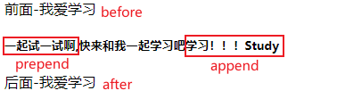

[TOC]


<div style="page-break-after: always;"></div>


jQuery 语法是通过选取 HTML 元素，并对选取的元素执行某些操作。

###  jQuery语法

#####  jQuery基础语法

$(selector).action()

- 美元符号定义 jQuery
- 选择符（selector）"查询"和"查找" HTML 元素
- jQuery 的 action() 执行对元素的操作

jQuery 库是一个 JavaScript 文件，您可以使用 HTML 的 <script> 标签引用它：

```
<head> 
    <script src="jquery.min.js"></script> 
</head>
```

或者使用在线的CDN：

```
<head> 
    <script src="https://ajax.aspnetcdn.com/ajax/jquery/jquery-1.9.0.min.js"></script> 
</head>
```

##### jQuery 入口函数

```
$(document).ready(function(){
    // 执行代码
});
或者
$(function(){
    // 执行代码
});
```

##### JavaScript 入口函数

```
window.onload = function () {
    // 执行代码
}
```

##### jQuery 入口函数与 JavaScript 入口函数的区别

- jQuery 的入口函数是在 html 所有标签(DOM)都加载之后，就会去执行。

- JavaScript 的 window.onload 事件是等到所有内容，包括外部图片之类的文件加载完后，才会执行。

  

<div style="page-break-after: always;"></div>

###  jQuery 事件

页面对不同访问者的响应叫做事件, jQuery 是为事件处理特别设计的。

###### $(document).ready() 方法

允许我们在文档完全加载完后执行函数。

###### click() 方法

是当按钮点击事件被触发时会调用一个函数。

###### dblclick()

当双击元素时，会发生 dblclick 事件。

###### mouseenter()

当鼠标指针穿过元素时，会发生 mouseenter 事件。

###### mouseleave()

当鼠标指针离开元素时，会发生 mouseleave 事件。

###### mousedown()

当鼠标指针移动到元素上方，并按下鼠标按键时，会发生 mousedown 事件。

###### mouseup()

当在元素上松开鼠标按钮时，会发生 mouseup 事件。

###### hover()

hover()方法用于模拟光标悬停事件。

###### focus()

当元素获得焦点时，发生 focus 事件。

###### blur()

当元素失去焦点时，发生 blur 事件。


<div style="page-break-after: always;"></div>


### jQuery 效果

##### 显隐效果

###### hide() 和 show() 

方法来隐藏和显示 HTML 元素。

```
$(selector).hide(speed,callback);

$(selector).show(speed,callback);
```

**可选的** speed 参数规定隐藏/显示的速度，可以取以下值："slow"、"fast" 或毫秒。

**可选的** callback 参数是隐藏或显示完成后所执行的函数名称。

###### toggle() 方法

来切换 hide() 和 show() 方法。

```
$(selector).toggle(speed,callback);
```

#####  淡入淡出效果

###### fadeIn() 方法

用于淡入已隐藏的元素。

```
$(selector).fadeIn(speed,callback);
```

**可选的** speed 参数规定效果的时长。它可以取以下值："slow"、"fast" 或毫秒。.

**可选的** callback 参数是 fading 完成后所执行的函数名称。

######  fadeOut() 方法

用于淡出可见元素。

```
$(selector).fadeOut(speed,callback);
```

######  fadeToggle() 方法

可以在 fadeIn() 与 fadeOut() 方法之间进行切换。

```
$(selector).fadeToggle(speed,callback);
```

######  fadeTo() 方法

允许渐变为给定的不透明度（值介于 0 与 1 之间）。

```
$(selector).fadeTo(speed,opacity,callback);
```

##### 滑动效果
###### slideDown() 方法

用于向下滑动元素。

```
$(selector).slideDown(speed,callback);
```

**可选的** speed 参数规定效果的时长。它可以取以下值："slow"、"fast" 或毫秒。

**可选的** callback 参数是滑动完成后所执行的函数名称。

###### slideUp() 方法

用于向上滑动元素。

```
$(selector).slideUp(speed,callback);
```

######  slideToggle() 方法

可以在 slideDown() 与 slideUp() 方法之间进行切换。

```
$(selector).slideToggle(speed,callback);
```

##### 动画

###### animate() 方法

用于创建自定义动画。

```
$(selector).animate({params},speed,callback);
```

**必需的** params 参数定义形成动画的 CSS 属性。

**可选的** speed 参数规定效果的时长。它可以取以下值："slow"、"fast" 或毫秒。

**可选的** callback 参数是动画完成后所执行的函数名称。

**可以用 animate() 方法来操作所有 CSS 属性吗？**

是的，几乎可以！不过，需要记住一件重要的事情：当使用 animate() 时，必须使用 Camel 标记法书写所有的属性名，比如，必须使用 paddingLeft 而不是 padding-left，使用 marginRight 而不是 margin-right，等等。同时，色彩动画并不包含在核心 jQuery 库中。

##### 停止动画

###### stop() 方法

用于停止动画或效果，在它们完成之前。

stop() 方法适用于所有 jQuery 效果函数，包括滑动、淡入淡出和自定义动画。

```
$(selector).stop(stopAll,goToEnd);
```

**可选的** stopAll 参数规定是否应该清除动画队列。默认是 false，即仅停止活动的动画，允许任何排入队列的动画向后执行。

**可选的** goToEnd 参数规定是否立即完成当前动画。默认是 false。因此，默认地，stop() 会清除在被选元素上指定的当前动画。

##### Callback 方法

###### Callback 函数

在当前动画 100% 完成之后执行。

实例：

```
$("button").click(function(){
  $("p").hide("slow",function(){
    alert("段落现在被隐藏了");
  });
});
```

##### 链(Chaining)

Chaining 允许我们在一条语句中运行多个 jQuery 方法（在相同的元素上）。

链接（chaining）的技术，允许我们在相同的元素上运行多条 jQuery 命令，一条接着另一条。这样的话，浏览器就不必多次查找相同的元素。

例子：

```
$("#p1").css("color","red").slideUp(2000).slideDown(2000);
```

### jQuery HTML

##### 获取内容和属性

DOM 操作：

**DOM = Document Object Model（文档对象模型）**

DOM 定义访问 HTML 和 XML 文档的标准：

"W3C 文档对象模型独立于平台和语言的界面，允许程序和脚本动态访问和更新文档的内容、结构以及样式。"

jQuery 中非常重要的部分，就是**操作 DOM** 的能力。

jQuery 提供一系列与 DOM 相关的方法，这使访问和操作元素和属性变得很容易。

##### 获得内容

三个简单实用的用于 DOM 操作的 jQuery 方法：

- text() - 设置或返回所选元素的文本内容
- html() - 设置或返回所选元素的内容（包括 HTML 标记）
- val() - 设置或返回表单字段的值

在线实例：

[菜鸟教程]: https://www.runoob.com/jquery/jquery-dom-get.html

##### 获取属性

- attr() 方法用于获取属性值。

实例：

```
$("button").click(function(){
  alert($("#runoob").attr("href"));//获取链接中herf属性的值
});
```

##### 设置内容

text()、html() 以及 val()，同样拥有回调函数。回调函数有两个参数：被选元素列表中当前元素的下标，以及原始（旧的）值。然后以函数新值返回您希望使用的字符串。

实例：

```
$("#btn1").click(function(){
    $("#test1").text(function(i,origText){
        return "旧文本: " + origText + " 新文本: Hello world! (index: " + i + ")"; 
    });
});
 
$("#btn2").click(function(){
    $("#test2").html(function(i,origText){
        return "旧 html: " + origText + " 新 html: Hello <b>world!</b> (index: " + i + ")"; 
    });
});
```

#####  设置属性

attr() 方法用于设置/改变属性值。

```
$("button").click(function(){
  $("#runoob").attr("href","http://www.runoob.com/jquery");
});
```

也允许同时设置多个属性。

下面的例子演示如何同时设置 href 和 title 属性：

```
$("button").click(function(){
    $("#runoob").attr({
        "href" : "http://www.runoob.com/jquery",
        "title" : "jQuery 教程"
    });
});
```

attr()，也提供回调函数。回调函数有两个参数：被选元素列表中当前元素的下标，以及原始（旧的）值。然后以函数新值返回您希望使用的字符串。

```
$("button").click(function(){
  $("#runoob").attr("href", function(i,origValue){
    return origValue + "/jquery"; 
  });
});
```

##### 添加元素

###### append() 

在**被选元素的结尾插入**内容

###### prepend() 

在**被选元素的开头**插入内容

###### after() 

在**被选元素之后**插入内容

###### before()

在**被选元素之前**插入内容

区别： append/prepend 是在选择元素内部嵌入。				
             after/before 是在元素外面追加。

```
$("p").append("追加文本");//在后面追加
$("p").prepend("在开头追加文本");
$("img").after("在后面添加文本");
$("img").before("在前面添加文本");
```



##### 删除元素

###### remove()

删除被选元素（**及其**子元素）

```
$("#div1").remove();
```

remove() 方法也可接受一个参数，允许对被删元素进行过滤。

该参数可以是任何 jQuery 选择器的语法。

```
$(document).ready(function(){
  $("button").click(function(){
    $("p").remove(".italic");
  });
});
<p>这是一个段落。</p>
<p class="italic"><i>这是另外一个段落。</i></p>
<p class="italic"><i>这是另外一个段落。</i></p>
<button>移除所有  class="italic" 的 p 元素。</button>
```

###### empty() 

删除被选元素**的**子元素。

```
$("#div1").empty();
```

#####  获取并设置 CSS 类

##### 操作 CSS

###### addClass()  

向被选元素添加一个或多个类

```
<script>
$(document).ready(function(){
  $("button").click(function(){
    $("h1,h2,p").addClass("blue");//选取多个属性
    $("div").addClass("important");
    $("body div:first").addClass("important blue");//规定多个类
  });
});
</script>
<style type="text/css">
.important
{font-weight:bold;font-size:xx-large;}
.blue{color:blue;}
</style>
```

###### removeClass()  

从被选元素删除一个或多个类

```
$("button").click(function(){
  $("h1,h2,p").removeClass("blue");//在不同的元素中删除指定的 class 属性
});
```

###### toggleClass()  

对被选元素进行添加/删除类的切换操作

```
$("button").click(function(){
  $("h1,h2,p").toggleClass("blue");//对被选元素进行添加/删除类的切换操作
});
```

###### css()  

设置或返回被选元素的一个或多个样式属性。

```
css("propertyname","value");//设置指定的 CSS 属性
css({"propertyname":"value","propertyname":"value",...});//设置多个 CSS 属性
```

```
$("p").css("background-color","yellow");//为所有匹配元素设置 background-color 值
$("p").css({"background-color":"yellow","font-size":"200%"});//为所有匹配元素设置 background-color 和 font-size
```

##### 尺寸方法


###### width() 方法

设置或返回元素的宽度（不包括内边距、边框或外边距）。

###### height() 方法

设置或返回元素的高度（不包括内边距、边框或外边距）。

```
$("button").click(function(){
  var txt="";
  txt+="div 的宽度是: " + $("#div1").width() + "</br>";
  txt+="div 的高度是: " + $("#div1").height();
  $("#div1").html(txt);
});
```

###### innerWidth() 方法

返回元素的宽度（包括内边距）。

###### innerHeight() 方法

返回元素的高度（包括内边距）。

```
$("button").click(function(){
  var txt="";
  txt+="div 宽度，包含内边距: " + $("#div1").innerWidth() + "</br>";
    txt+="div 高度，包含内边距: " + $("#div1").innerHeight();
  $("#div1").html(txt);
});
```

###### outerWidth() 方法

返回元素的宽度（包括内边距和边框）。

###### outerHeight() 方法

返回元素的高度（包括内边距和边框）。

```
$("button").click(function(){
  var txt="";
  txt+="div 宽度，包含内边距和边框: " + $("#div1").outerWidth() + "</br>";
  txt+="div 高度，包含内边距和边框: " + $("#div1").outerHeight();
  $("#div1").html(txt);
});
```

唯一需要注意的地方，设置了 box-sizing 后，width() 获取的是 css 设置的 width 减去 padding 和 border 的值。

```
.test{width:100px;height:100px;padding:10px;border:10px;box-sizing:border-box;}
```

-  width() 获取为: 60
-  innerWidth() 获取值为: 80
-  outWidth() 获取值为: 100

### jQuery遍历

jQuery 遍历，意为"移动"，用于根据其相对于其他元素的关系来"查找"（或选取）HTML 元素。以某项选择开始，并沿着这个选择移动，直到抵达您期望的元素为止。

下图展示了一个家族树。通过 jQuery 遍历，您能够从被选（当前的）元素开始，轻松地在家族树中向上移动（祖先），向下移动（子孙），水平移动（同胞）。这种移动被称为对 DOM 进行遍历。


图示解析：


- `<div>` 元素是 `<ul>` 的父元素，同时是其中所有内容的祖先。

- `<ul>` 元素是 `<li>` 元素的父元素，同时是 `<div>` 的子元素

- 左边的 `<li>` 元素是 `<span>` 的父元素，`<ul>` 的子元素，同时是 `<div>` 的后代。

- `<span>` 元素是 `<li>` 的子元素，同时是 `<ul>` 和 `<div>` 的后代。

- 两个 `<li>` 元素是同胞（拥有相同的父元素）。

- 右边的 `<li>` 元素是 `<b>` 的父元素，`<ul>` 的子元素，同时是 `<div>` 的后代。

- `<b>` 元素是右边的 `<li>` 的子元素，同时是 `<ul>` 和 `<div>` 的后代。

##### 向上遍历 DOM 树，查找元素先祖

###### parent() 方法

返回被选元素的直接父元素。该方法只会向上一级对 DOM 树进行遍历。

例子：返回每个 <span> 元素的直接父元素

```
$(document).ready(function(){
  $("span").parent();
});
```

###### parents() 方法

返回被选元素的所有祖先元素，它一路向上直到文档的根元素 (<html>)。

例子：返回所有 <span> 元素的所有祖先

```
$(document).ready(function(){
  $("span").parents();
});
```

使用可选参数来过滤对祖先元素的搜索。

例子：返回所有 <span> 元素的所有祖先，并且它是 <ul> 元素

```
$(document).ready(function(){
  $("span").parents("ul");
});
```

###### parentsUntil() 方法

返回介于两个给定元素之间的所有祖先元素。

例子：返回介于 <span> 与 <div> 元素之间的所有祖先元素

```
$(document).ready(function(){
  $("span").parentsUntil("div");
});
```

##### 向下遍历 DOM 树，查找元素后代

###### children() 方法

返回被选元素的所有直接子元素。该方法只会向下一级对 DOM 树进行遍历。

例子：返回每个 <div> 元素的所有直接子元素

```
$(document).ready(function(){
  $("div").children();
});
```

可以使用可选参数来过滤对子元素的搜索。

例子：返回类名为 "1" 的所有 <p> 元素，并且它们是 <div> 的直接子元素

```
$(document).ready(function(){
  $("div").children("p.1");
});
```

###### find() 方法

返回被选元素的后代元素，一路向下直到最后一个后代。

例子：返回属于 <div> 后代的所有 <span> 元素

```
$(document).ready(function(){
  $("div").find("span");
});
```

例子：返回 <div> 的所有后代

```
$(document).ready(function(){
  $("div").find("*");
});
```

##### 水平遍历DOM树，查找元素同胞

###### siblings() 方法

返回被选元素的所有同胞元素。

例子：返回 <h2> 的所有同胞元素

```
$(document).ready(function(){
  $("h2").siblings();
});
```

使用可选参数来过滤对同胞元素的搜索。

例子：返回属于 <h2> 的同胞元素的所有 <p> 元素

```
$(document).ready(function(){
  $("h2").siblings("p");
})
```

###### next() 方法

返回被选元素的下一个同胞元素。该方法只返回一个元素。

###### nextAll() 方法

返回被选元素的所有跟随的同胞元素。


