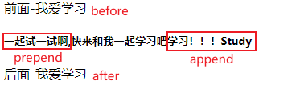

### jQuery HTML

#### 获取内容和属性

DOM 操作：

**DOM = Document Object Model（文档对象模型）**

DOM 定义访问 HTML 和 XML 文档的标准：

"W3C 文档对象模型独立于平台和语言的界面，允许程序和脚本动态访问和更新文档的内容、结构以及样式。"

jQuery 中非常重要的部分，就是**操作 DOM** 的能力。

jQuery 提供一系列与 DOM 相关的方法，这使访问和操作元素和属性变得很容易。

##### 获得内容

三个简单实用的用于 DOM 操作的 jQuery 方法：

- text() - 设置或返回所选元素的文本内容
- html() - 设置或返回所选元素的内容（包括 HTML 标记）
- val() - 设置或返回表单字段的值

在线实例：

[菜鸟教程]: https://www.runoob.com/jquery/jquery-dom-get.html

##### 获取属性

- attr() 方法用于获取属性值。

实例：

```
$("button").click(function(){
  alert($("#runoob").attr("href"));//获取链接中herf属性的值
});
```

##### 设置内容

text()、html() 以及 val()，同样拥有回调函数。回调函数有两个参数：被选元素列表中当前元素的下标，以及原始（旧的）值。然后以函数新值返回您希望使用的字符串。

实例：

```
$("#btn1").click(function(){
    $("#test1").text(function(i,origText){
        return "旧文本: " + origText + " 新文本: Hello world! (index: " + i + ")"; 
    });
});
 
$("#btn2").click(function(){
    $("#test2").html(function(i,origText){
        return "旧 html: " + origText + " 新 html: Hello <b>world!</b> (index: " + i + ")"; 
    });
});
```

#####  设置属性

attr() 方法用于设置/改变属性值。

```
$("button").click(function(){
  $("#runoob").attr("href","http://www.runoob.com/jquery");
});
```

也允许同时设置多个属性。

下面的例子演示如何同时设置 href 和 title 属性：

```
$("button").click(function(){
    $("#runoob").attr({
        "href" : "http://www.runoob.com/jquery",
        "title" : "jQuery 教程"
    });
});
```

attr()，也提供回调函数。回调函数有两个参数：被选元素列表中当前元素的下标，以及原始（旧的）值。然后以函数新值返回您希望使用的字符串。

```
$("button").click(function(){
  $("#runoob").attr("href", function(i,origValue){
    return origValue + "/jquery"; 
  });
});
```

##### 添加元素

###### append() 

在**被选元素的结尾插入**内容

###### prepend() 

在**被选元素的开头**插入内容

###### after() 

在**被选元素之后**插入内容

###### before()

在**被选元素之前**插入内容

区别： append/prepend 是在选择元素内部嵌入。				
             after/before 是在元素外面追加。

```
$("p").append("追加文本");//在后面追加
$("p").prepend("在开头追加文本");
$("img").after("在后面添加文本");
$("img").before("在前面添加文本");
```



##### 删除元素

###### remove()

删除被选元素（**及其**子元素）

```
$("#div1").remove();
```

remove() 方法也可接受一个参数，允许对被删元素进行过滤。

该参数可以是任何 jQuery 选择器的语法。

```
$(document).ready(function(){
  $("button").click(function(){
    $("p").remove(".italic");
  });
});
<p>这是一个段落。</p>
<p class="italic"><i>这是另外一个段落。</i></p>
<p class="italic"><i>这是另外一个段落。</i></p>
<button>移除所有  class="italic" 的 p 元素。</button>
```

###### empty() 

删除被选元素**的**子元素。

```
$("#div1").empty();
```

####  获取并设置 CSS 类

##### 操作 CSS

###### addClass()  

向被选元素添加一个或多个类

```
<script>
$(document).ready(function(){
  $("button").click(function(){
    $("h1,h2,p").addClass("blue");//选取多个属性
    $("div").addClass("important");
    $("body div:first").addClass("important blue");//规定多个类
  });
});
</script>
<style type="text/css">
.important
{font-weight:bold;font-size:xx-large;}
.blue{color:blue;}
</style>
```

###### removeClass()  

从被选元素删除一个或多个类

```
$("button").click(function(){
  $("h1,h2,p").removeClass("blue");//在不同的元素中删除指定的 class 属性
});
```

###### toggleClass()  

对被选元素进行添加/删除类的切换操作

```
$("button").click(function(){
  $("h1,h2,p").toggleClass("blue");//对被选元素进行添加/删除类的切换操作
});
```

###### css()  

设置或返回被选元素的一个或多个样式属性。

```
css("propertyname","value");//设置指定的 CSS 属性
css({"propertyname":"value","propertyname":"value",...});//设置多个 CSS 属性
```

```
$("p").css("background-color","yellow");//为所有匹配元素设置 background-color 值
$("p").css({"background-color":"yellow","font-size":"200%"});//为所有匹配元素设置 background-color 和 font-size
```

##### 尺寸方法


###### width() 方法

设置或返回元素的宽度（不包括内边距、边框或外边距）。

###### height() 方法

设置或返回元素的高度（不包括内边距、边框或外边距）。

```
$("button").click(function(){
  var txt="";
  txt+="div 的宽度是: " + $("#div1").width() + "</br>";
  txt+="div 的高度是: " + $("#div1").height();
  $("#div1").html(txt);
});
```

###### innerWidth() 方法

返回元素的宽度（包括内边距）。

###### innerHeight() 方法

返回元素的高度（包括内边距）。

```
$("button").click(function(){
  var txt="";
  txt+="div 宽度，包含内边距: " + $("#div1").innerWidth() + "</br>";
    txt+="div 高度，包含内边距: " + $("#div1").innerHeight();
  $("#div1").html(txt);
});
```

###### outerWidth() 方法

返回元素的宽度（包括内边距和边框）。

###### outerHeight() 方法

返回元素的高度（包括内边距和边框）。

```
$("button").click(function(){
  var txt="";
  txt+="div 宽度，包含内边距和边框: " + $("#div1").outerWidth() + "</br>";
  txt+="div 高度，包含内边距和边框: " + $("#div1").outerHeight();
  $("#div1").html(txt);
});
```

唯一需要注意的地方，设置了 box-sizing 后，width() 获取的是 css 设置的 width 减去 padding 和 border 的值。

```
.test{width:100px;height:100px;padding:10px;border:10px;box-sizing:border-box;}
```

-  width() 获取为: 60
-  innerWidth() 获取值为: 80
-  outWidth() 获取值为: 100